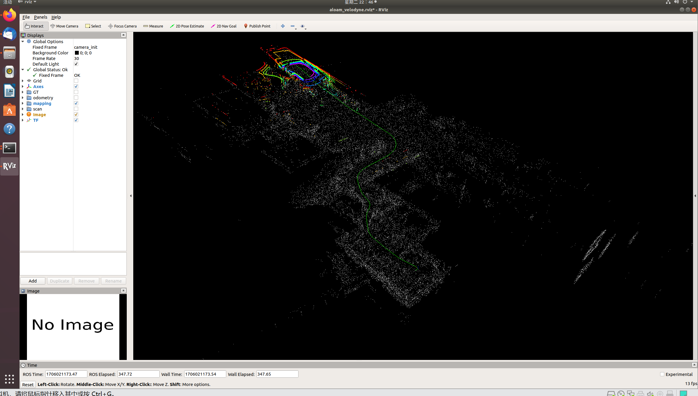

# ALOAM学习

## (一). kittiHelper.cpp
kitti helper 的作用主要是读取 kitti 的数据并转化为 ros 消息发布或写入 rosbag 中，方便后续节点直接使用。

由于 kitti 的数据集中，位姿真值是通过 gps/imu 的输出经校正后投影到左相机坐标系下的，loam 中使用的是激光点云，所以这里后续会将真值 pose 所在的 camera 系经过旋转和 lidar 系对齐（但还有一定平移）。因此，这里 odom 和 path publisher 的 frame id 是 kitti 原来的 left camera 系经过旋转的。

###
## (二). sanRegistration.cpp
scanRegistration 节点的作用包括：

- 接收原始点云，去除无效点以及跟雷达距离过近的点
- 根据激光雷达的性质，计算每个点所属的扫描线以及相对于当前帧点云起始点的时间
- 提取角点和平面点
- 将预处理之后的点云以及提取出来的角点和平面点点云发布，供其余节点使用

以上操作都是在接收点云的回调函数上执行，每接收一次点云对该点云进行一次处理。

### 1.main函数
```cpp
int main(int argc, char **argv)
{
    // 初始化节点
    ros::init(argc, argv, "scanRegistration");
    ros::NodeHandle nh;

    // 获取参数
    // 默认雷达线数为 16
    nh.param<int>("scan_line", N_SCANS, 16);
    // 默认能够获取的最近的雷达点的距离为 0.1 m，低于这个范围内的点不使用
    nh.param<double>("minimum_range", MINIMUM_RANGE, 0.1);

    printf("scan line number %d \n", N_SCANS);

    if(N_SCANS != 16 && N_SCANS != 32 && N_SCANS != 64)
    {
        printf("only support velodyne with 16, 32 or 64 scan line!");
        return 0;
    }

    // 初始化一系列 subscribers 和 publishers

    // 订阅原始点云消息
    ros::Subscriber subLaserCloud = nh.subscribe<sensor_msgs::PointCloud2>("/velodyne_points", 100, laserCloudHandler);

    // 发布过滤后的点云消息（去除 NaN /距离过近/ 测量值不准确的点）
    pubLaserCloud = nh.advertise<sensor_msgs::PointCloud2>("/velodyne_cloud_2", 100);

    // 发布曲率高的的角点点云
    pubCornerPointsSharp = nh.advertise<sensor_msgs::PointCloud2>("/laser_cloud_sharp", 100);
    
    // 发布曲率相对较低的角点点云
    pubCornerPointsLessSharp = nh.advertise<sensor_msgs::PointCloud2>("/laser_cloud_less_sharp", 100);

    // 发布平面度高的平面点点云
    pubSurfPointsFlat = nh.advertise<sensor_msgs::PointCloud2>("/laser_cloud_flat", 100);

    // 发布平面度相对较低的平面点点云
    pubSurfPointsLessFlat = nh.advertise<sensor_msgs::PointCloud2>("/laser_cloud_less_flat", 100);

    // 发布被去除的点云
    pubRemovePoints = nh.advertise<sensor_msgs::PointCloud2>("/laser_remove_points", 100);

    if(PUB_EACH_LINE)
    {
        for(int i = 0; i < N_SCANS; i++)
        {
            // 对激光雷达每条线设置单独的点云 publisher
            ros::Publisher tmp = nh.advertise<sensor_msgs::PointCloud2>("/laser_scanid_" + std::to_string(i), 100);
            pubEachScan.push_back(tmp);
        }
    }
    ros::spin();

    return 0;
}
```
### 2. removeClosedPointCloud函数(laserCloudHandler函数中使用)
- 预先分配空间以避免添加的点的时候造成频繁的空间分配
- 过滤掉距离过近的点
```cpp
void removeClosedPointCloud(const pcl::PointCloud<PointT> &cloud_in,
                              pcl::PointCloud<PointT> &cloud_out, float thres)
{
    // 初始化返回点云，预先分配空间以避免添加的点的时候造成频繁的空间分配
    if (&cloud_in != &cloud_out)
    {
        cloud_out.header = cloud_in.header;
        cloud_out.points.resize(cloud_in.points.size());
    }

    size_t j = 0;

    for (size_t i = 0; i < cloud_in.points.size(); ++i)
    {
        // 过滤掉距离过近的点
        if (cloud_in.points[i].x * cloud_in.points[i].x + cloud_in.points[i].y * cloud_in.points[i].y + cloud_in.points[i].z * cloud_in.points[i].z < thres * thres)
            continue;
        cloud_out.points[j] = cloud_in.points[i];
        j++;
    }
    if (j != cloud_in.points.size())
    {
        cloud_out.points.resize(j);
    }

    // 过滤掉之后每一条线的激光雷达数量不一定所以没有办法通过宽和高区分线
    // 因此这里不做特殊处理
    cloud_out.height = 1;
    cloud_out.width = static_cast<uint32_t>(j);
    cloud_out.is_dense = true;
}
```
### 3. laserCloudHandler函数
####  (1) 点云预处理
##### 去除无效点
```cpp
// 对点云进行预处理，去除掉不合要求的点
pcl::removeNaNFromPointCloud(laserCloudIn, laserCloudIn, indices);
removeClosedPointCloud(laserCloudIn, laserCloudIn, MINIMUM_RANGE);
```
##### 计算起始点和结束点的朝向
```cpp
// 通常激光雷达扫描方向是顺时针，这里在取 atan 的基础上先取反，这样起始点理论上为 -pi，结束点为 pi，更符合直观
// 理论上起始点和结束点的差值应该是 0，为了显示两者区别，将结束点的方向补偿 2pi
// 表示结束点和起始点实际上逆时针经过一圈
float startOri = -atan2(laserCloudIn.points[0].y, laserCloudIn.points[0].x);
float endOri = -atan2(laserCloudIn.points[cloudSize - 1].y,
                        laserCloudIn.points[cloudSize - 1].x) +
                2 * M_PI;

// 处理几种个别情况，以保持结束点的朝向和起始点的方向差始终在 [pi, 3pi] 之间 （实际上是 2pi 附近）
if (endOri - startOri > 3 * M_PI)
{
    // case 1: 起始点在 -179°，结束点在 179°，补偿 2pi 后相差超过一圈，实际上是结束点相对于起始点还没转完整一圈
    // 因此将结束点的 2pi 补偿去掉为 179°，与起始点相差 358°，表示结束点和起始点差别是一圈少2°
    endOri -= 2 * M_PI;
}

else if (endOri - startOri < M_PI)
{
    // case 2: 起始点为 179°，结束点为 -179°，补偿后结束点为 181°，此时不能反映真实差别，需要
    // 对结束点再补偿上 2pi，表示经过了一圈多 2°
    endOri += 2 * M_PI;
}
//printf("end Ori %f\n", endOri);
```
##### 将点云按扫描线分别存储在一个子点云中
```cpp
std::vector<pcl::PointCloud<PointType>> laserCloudScans(N_SCANS);
for (int i = 0; i < cloudSize; i++)
{
    // 小技巧对临时变量 Point 只初始化一次减少空间分配
    point.x = laserCloudIn.points[i].x;
    point.y = laserCloudIn.points[i].y;
    point.z = laserCloudIn.points[i].z;

    // 计算激光点的俯仰角
    float angle = atan(point.z / sqrt(point.x * point.x + point.y * point.y)) * 180 / M_PI;
    int scanID = 0;

    if (N_SCANS == 16)
    {
        // velodyne 激光雷达的竖直 FoV 是[-15, -15]，分辨率是 2°，这里通过这样的计算可以
        // 对改激光点分配一个 [0, 15] 的扫描线 ID
        scanID = int((angle + 15) / 2 + 0.5);

        // 如果点的距离值不准有可能会计算出不在范围内的 ID 此时不考虑这个点
        if (scanID > (N_SCANS - 1) || scanID < 0)
        {
            count--;
            continue;
        }
    }
    else if (N_SCANS == 32)
    {
        // 思路和 16 线的情况一致
        scanID = int((angle + 92.0/3.0) * 3.0 / 4.0);
        if (scanID > (N_SCANS - 1) || scanID < 0)
        {
            count--;
            continue;
        }
    }
    else if (N_SCANS == 64)
    {   
        // 和 16 线的情况一致
        if (angle >= -8.83)
            scanID = int((2 - angle) * 3.0 + 0.5);
        else
            scanID = N_SCANS / 2 + int((-8.83 - angle) * 2.0 + 0.5);

        // use [0 50]  > 50 remove outlies
        // 不考虑扫描线 id 在50以上的点 
        if (angle > 2 || angle < -24.33 || scanID > 50 || scanID < 0)
        {
            count--;
            continue;
        }
    }
    else
    {
        printf("wrong scan number\n");
        ROS_BREAK();
    }
    //printf("angle %f scanID %d \n", angle, scanID);

    // 计算激光点水平方向角，通过取反操作可以讲雷达扫描方向为逆时针（-pi 到 pi）
    float ori = -atan2(point.y, point.x);
    if (!halfPassed)
    { 
        // 对一些 Corner case 处理
        if (ori < startOri - M_PI / 2)
        {
            // case 1：起始点在 179 °，逆时针转过几度后，当前点是 -179°，需要加上 2pi 作为补偿
            ori += 2 * M_PI;
        }
        else if (ori > startOri + M_PI * 3 / 2)
        {
            // case 2: 理论上在逆时针转的时候不会出现这种情况，在顺时针的情况下，起始点在 -179°，
            // 顺时针转过两度后到 179°，此时差距过大，需要减去 2pi
            ori -= 2 * M_PI;
        }

        if (ori - startOri > M_PI)
        {
            // 角度校正后如果和起始点相差超过 pi，表示已经过半圈
            halfPassed = true;
        }
    }
    else
    {
        // 经过半圈后，部分情况（扫描线从 179°到 -179°时）需要加 2pi，
        ori += 2 * M_PI;
        if (ori < endOri - M_PI * 3 / 2)
        {
            // case 1: 在逆时针下理论上不会出现
            ori += 2 * M_PI;
        }
        else if (ori > endOri + M_PI / 2)
        {
            // case 2: 起始点在 -179°，逆时针经过半圈后当前点在 1°，
            // 此时差值是对的，因此将2pi补偿减去
            ori -= 2 * M_PI;
        }
    }

    // 估计当前当前点和起始点的时间差
    float relTime = (ori - startOri) / (endOri - startOri);
    // 小技巧：用 intensity的整数部分和小数部分来存储该点所属的扫描线以及相对时间：
    // [线id].[相对时间*扫描周期]
    point.intensity = scanID + scanPeriod * relTime;
    laserCloudScans[scanID].push_back(point); 
}
```
##### (2) 计算曲率,提取边缘点和平面点
- 从曲率最大的点中开始选择角点，代码中将角点分成了质量较好的角点点云以及相对一般的候选点点云
- 如果选择的点曲率没有超过给定阈值，则不考虑
- 如果已选角点小于 2，则同时加入到两个角点点云中，会主动和上一帧角点特征进行匹配
- 如果已选角点大于 2 但小于 20，则只加入到质量一般的候选角点中，用于和下一帧的较好角点进行匹配
- 如果角点已经 20 个以上，则不继续添加角点
```cpp
pcl::PointCloud<PointType>::Ptr laserCloud(new pcl::PointCloud<PointType>());
for (int i = 0; i < N_SCANS; i++)
{ 
    // 将每个扫描线上的局部点云汇总至一个点云里面，并计算每个扫描线对应的起始和结束坐标
    // 这里每个扫描线上的前 5 个和后 5 个点都不考虑（因为计算曲率时需要用到左右相邻 5 个点）
    scanStartInd[i] = laserCloud->size() + 5;
    *laserCloud += laserCloudScans[i];
    scanEndInd[i] = laserCloud->size() - 6;
}

// 打印点云预处理的耗时
printf("prepare time %f \n", t_prepare.toc());

for (int i = 5; i < cloudSize - 5; i++)
{ 
    // 计算当前点和周围十个点（左右各 5 个）在 x, y, z 方向上的差值： 10*p_i - sum(p_{i-5:i-1,i+1:i+5})
    // 注意这里对每一条扫描线的边缘的计算是有问题的，因为会引入相邻扫描线的点，但见上面操作，每一条扫描线我们不考虑边缘的五个点，所以为了方便可以这么操作
    float diffX = laserCloud->points[i - 5].x + laserCloud->points[i - 4].x + laserCloud->points[i - 3].x + laserCloud->points[i - 2].x + laserCloud->points[i - 1].x - 10 * laserCloud->points[i].x + laserCloud->points[i + 1].x + laserCloud->points[i + 2].x + laserCloud->points[i + 3].x + laserCloud->points[i + 4].x + laserCloud->points[i + 5].x;
    float diffY = laserCloud->points[i - 5].y + laserCloud->points[i - 4].y + laserCloud->points[i - 3].y + laserCloud->points[i - 2].y + laserCloud->points[i - 1].y - 10 * laserCloud->points[i].y + laserCloud->points[i + 1].y + laserCloud->points[i + 2].y + laserCloud->points[i + 3].y + laserCloud->points[i + 4].y + laserCloud->points[i + 5].y;
    float diffZ = laserCloud->points[i - 5].z + laserCloud->points[i - 4].z + laserCloud->points[i - 3].z + laserCloud->points[i - 2].z + laserCloud->points[i - 1].z - 10 * laserCloud->points[i].z + laserCloud->points[i + 1].z + laserCloud->points[i + 2].z + laserCloud->points[i + 3].z + laserCloud->points[i + 4].z + laserCloud->points[i + 5].z;

    // 计算曲率
    cloudCurvature[i] = diffX * diffX + diffY * diffY + diffZ * diffZ;
    // 特征点相关参数初始化
    cloudSortInd[i] = i;
    // 这里实质上使用 1/0 来表示其相邻点是否已经选取，但是c++里面不推荐用 vector<bool> 来存储 bool
    cloudNeighborPicked[i] = 0;
    cloudLabel[i] = 0;
}


TicToc t_pts;

// 初始化四个点云，分别是：曲率高以及相对不那么高的点云，平面度高以及相对不那么高的平面点
pcl::PointCloud<PointType> cornerPointsSharp;
pcl::PointCloud<PointType> cornerPointsLessSharp;
pcl::PointCloud<PointType> surfPointsFlat;
pcl::PointCloud<PointType> surfPointsLessFlat;

float t_q_sort = 0;
// 在每条扫描线上提取特征点
for (int i = 0; i < N_SCANS; i++)
{
    // 不考虑少于 5 个点的扫描线
    if( scanEndInd[i] - scanStartInd[i] < 6)
        continue;

    
    pcl::PointCloud<PointType>::Ptr surfPointsLessFlatScan(new pcl::PointCloud<PointType>);
    // 将每条扫描线平均分成 6 个区域，按区域提取特征点
    for (int j = 0; j < 6; j++)
    {
        // start pointer & end pointer：对于每个区域起始和末尾指针
        int sp = scanStartInd[i] + (scanEndInd[i] - scanStartInd[i]) * j / 6; 
        int ep = scanStartInd[i] + (scanEndInd[i] - scanStartInd[i]) * (j + 1) / 6 - 1;

        TicToc t_tmp;
        // 按照曲率对当前区域的点进行从小到大排序
        std::sort (cloudSortInd + sp, cloudSortInd + ep + 1, comp);
        t_q_sort += t_tmp.toc();

        int largestPickedNum = 0;
        // 按曲率从大到小对激光进行遍历，提取角点
        for (int k = ep; k >= sp; k--)
        {
            // 获取当前的点在点云中的下标
            int ind = cloudSortInd[k]; 

            // 当前当前的点的曲率大于一定阈值并且还没有被选择
            if (cloudNeighborPicked[ind] == 0 &&
                cloudCurvature[ind] > 0.1)
            {

                largestPickedNum++;
                
                if (largestPickedNum <= 2)
                {
                    // 如果已经选择的角点数小于2，将其加入两个角点点云中
                    // 标签 2 表示它是质量好的角点                        
                    cloudLabel[ind] = 2;
                    cornerPointsSharp.push_back(laserCloud->points[ind]);
                    cornerPointsLessSharp.push_back(laserCloud->points[ind]);
                }
                else if (largestPickedNum <= 20)
                {
                    // 如果已经选择的角点数大于 2 但小于 20 个时，将其作为备用角点加入到
                    // 曲率相对不太高的角点点云中，标签 1 表示这个点可以作为角点，但质量不太好                        
                    cloudLabel[ind] = 1; 
                    cornerPointsLessSharp.push_back(laserCloud->points[ind]);
                }
                else
                {
                    // 如果已经选择的角点已经超过 20 个，则不再考虑后续的点
                    break;
                }

                // 设置相邻点选取标志位，表示当前已经被选择
                cloudNeighborPicked[ind] = 1; 

                // 对选择点的左右相邻 5 个点进行分析
                for (int l = 1; l <= 5; l++)
                {
                    // 如果点和前一个点的距离不超过阈值，将其标记为已经被选择中
                    // 表示这个点和某个已经被提取的特征点过近，因此不作为特征点考虑
                    float diffX = laserCloud->points[ind + l].x - laserCloud->points[ind + l - 1].x;
                    float diffY = laserCloud->points[ind + l].y - laserCloud->points[ind + l - 1].y;
                    float diffZ = laserCloud->points[ind + l].z - laserCloud->points[ind + l - 1].z;
                    if (diffX * diffX + diffY * diffY + diffZ * diffZ > 0.05)
                    {
                        break;
                    }

                    cloudNeighborPicked[ind + l] = 1;
                }
                for (int l = -1; l >= -5; l--)
                {
                    // 和上一部分思路类似
                    float diffX = laserCloud->points[ind + l].x - laserCloud->points[ind + l + 1].x;
                    float diffY = laserCloud->points[ind + l].y - laserCloud->points[ind + l + 1].y;
                    float diffZ = laserCloud->points[ind + l].z - laserCloud->points[ind + l + 1].z;
                    if (diffX * diffX + diffY * diffY + diffZ * diffZ > 0.05)
                    {
                        break;
                    }

                    cloudNeighborPicked[ind + l] = 1;
                }
            }
        }

        int smallestPickedNum = 0;
        // 按曲率从小到大遍历点，提取平面点
        for (int k = sp; k <= ep; k++)
        {
            // 提取该点在点云的下标
            int ind = cloudSortInd[k];

            // 如果当前点曲率小于给定阈值并且还没有被选择，进行分析
            if (cloudNeighborPicked[ind] == 0 &&
                cloudCurvature[ind] < 0.1)
            {

                // 标记当前点为 -1，表示其为平面度高的平面点
                cloudLabel[ind] = -1; 
                surfPointsFlat.push_back(laserCloud->points[ind]);

                smallestPickedNum++;
                
                
                if (smallestPickedNum >= 4)
                { 
                    // 如果已经选了 4 个平面点，后续的点不予考虑
                    break;
                }

                // 将其标记为已选择，并对其左右相邻 5 个距离较近的点也标记为已选择
                cloudNeighborPicked[ind] = 1;
                for (int l = 1; l <= 5; l++)
                { 
                    float diffX = laserCloud->points[ind + l].x - laserCloud->points[ind + l - 1].x;
                    float diffY = laserCloud->points[ind + l].y - laserCloud->points[ind + l - 1].y;
                    float diffZ = laserCloud->points[ind + l].z - laserCloud->points[ind + l - 1].z;
                    if (diffX * diffX + diffY * diffY + diffZ * diffZ > 0.05)
                    {
                        break;
                    }

                    cloudNeighborPicked[ind + l] = 1;
                }
                for (int l = -1; l >= -5; l--)
                {
                    float diffX = laserCloud->points[ind + l].x - laserCloud->points[ind + l + 1].x;
                    float diffY = laserCloud->points[ind + l].y - laserCloud->points[ind + l + 1].y;
                    float diffZ = laserCloud->points[ind + l].z - laserCloud->points[ind + l + 1].z;
                    if (diffX * diffX + diffY * diffY + diffZ * diffZ > 0.05)
                    {
                        break;
                    }

                    cloudNeighborPicked[ind + l] = 1;
                }
            }
        }

        for (int k = sp; k <= ep; k++)
        {
            if (cloudLabel[k] <= 0)
            {
                // 将所有不被判断为角点(标签为 1/2)的点都作为平面点的候选点
                surfPointsLessFlatScan->push_back(laserCloud->points[k]);
            }
        }
    }

    // 由于LessFlat 的平面点数量太多（除了角点以外都是），因此对其进行下采样存储
    pcl::PointCloud<PointType> surfPointsLessFlatScanDS;
    pcl::VoxelGrid<PointType> downSizeFilter;
    downSizeFilter.setInputCloud(surfPointsLessFlatScan);
    downSizeFilter.setLeafSize(0.2, 0.2, 0.2);
    downSizeFilter.filter(surfPointsLessFlatScanDS);

    surfPointsLessFlat += surfPointsLessFlatScanDS;
}
```
ALOAM提取特征点中没有对LOAM论文中两类不可提取的点的排除
## (三) laserOdometry.cpp
laserOdometry 节点的主要作用是作为 a loam 的里程计对激光雷达的位姿进行快速的估计，大致过程为：

- 从 scanRegistraion 中接收预处理后的点云以及各个特征点点云，并将其存放在相应的缓冲队列中
- 每一次从各个缓冲队列中获取最早的一帧点云以及相应的特征点
- 对每一个特征点（平面点/角点），在上一帧中找到相应的特征点及其构成的点，对角点来说是两个点构成一个角点特征；对平面点来说是三个点构成一个平面
- 将当前分析的特征点以及找到的匹配特征点作为观测值加入 ceres 问题中构建残差
- 对所有观测值进行优化
- 更新世界坐标系下的位姿以及发布更新后的点云
### 1.  将点云姿态转移到相应时刻
```cpp
// undistort lidar point
void TransformToStart(PointType const *const pi, PointType *const po)
{
    //interpolation ratio
    double s;
    if (DISTORTION)
        // 相减得到 pi 相对于该扫描线起始点的时间差*扫描周期，
        // 除以扫描周期得到相对于该扫描线起始点的时间差
        s = (pi->intensity - int(pi->intensity)) / SCAN_PERIOD;
    else
        s = 1.0;
    //s = 1;
    // 线性插值得到当前点相对于该帧起始点的旋转，插值范围为：[I, q_last_curr]
    // s = 0 得到 I,表示相对于起始点没有旋转，s = 1 表示至结束点，旋转就是 last to current 的旋转
    Eigen::Quaterniond q_point_last = Eigen::Quaterniond::Identity().slerp(s, q_last_curr);
    Eigen::Vector3d t_point_last = s * t_last_curr;

    // 去畸变过程
    Eigen::Vector3d point(pi->x, pi->y, pi->z);
    Eigen::Vector3d un_point = q_point_last * point + t_point_last;

    po->x = un_point.x();
    po->y = un_point.y();
    po->z = un_point.z();
    po->intensity = pi->intensity;
}

// transform all lidar points to the start of the next frame

void TransformToEnd(PointType const *const pi, PointType *const po)
{
    // undistort point first
    pcl::PointXYZI un_point_tmp;
    TransformToStart(pi, &un_point_tmp);

    Eigen::Vector3d un_point(un_point_tmp.x, un_point_tmp.y, un_point_tmp.z);
    Eigen::Vector3d point_end = q_last_curr.inverse() * (un_point - t_last_curr);

    po->x = point_end.x();
    po->y = point_end.y();
    po->z = point_end.z();

    //Remove distortion time info
    po->intensity = int(pi->intensity);
}
```


1. `TransformToStart` 函数的作用是将点云数据从当前帧的坐标系变换到当前帧的起始点坐标系。具体步骤如下：

    a. 首先计算相对于当前帧起始点的时间差 `s`。如果启用了畸变校正（`DISTORTION`为真），则时间差为当前点的强度值除以扫描周期（`SCAN_PERIOD`）得到的小数部分；否则，直接设置时间差为 1.0，表示当前点为当前帧的最后一个点。

    b. 使用线性插值（Slerp）得到当前点相对于当前帧的起始点的旋转 `q_point_last` 和平移 `t_point_last`。旋转和平移的插值范围为当前帧的起始点（Identity）到当前帧的变换（`q_last_curr` 和 `t_last_curr`）。

    c. 将当前点应用畸变校正，得到校正后的点 `un_point`。

2. `TransformToEnd` 函数的作用是将校正后的点云数据从当前帧的坐标系变换到下一帧的坐标系。具体步骤如下：

    a. 首先调用 `TransformToStart` 函数进行畸变校正，得到校正后的点 `un_point_tmp`。

    b. 将校正后的点 `un_point_tmp` 反向变换到下一帧的坐标系，得到点的末端坐标 `point_end`。这一步使用了当前帧到下一帧的变换的逆变换，即 `q_last_curr.inverse()` 和 `-t_last_curr`。

    c. 将点的末端坐标赋值给输出点云数据。

在这段代码中，主要涉及了以下数学原理：

1. **四元数插值（Slerp）**：
   四元数是一种用来表示三维空间中的旋转的数学工具。在这段代码中，使用了四元数的 Slerp 插值（球面线性插值）来进行旋转的插值。具体来说，给定两个四元数 Q1 和 Q2，以及一个插值因子 t，Slerp 插值能够得到一个介于 Q1 和 Q2 之间的新的四元数 Q，表示从 Q1 到 Q2 的旋转过程。其公式如下：
   \[ Q = Q_1 \left( Q_1^{-1} Q_2 \right)^t \]
   其中，\( Q_1^{-1} \) 表示 Q1 的逆四元数，而 \( ( Q_1^{-1} Q_2 )^t \) 则表示将 Q1 的逆四元数与 Q2 相乘后再取 t 次幂。

2. **点云坐标变换**：
   在点云处理中，通常需要将点云数据从一个坐标系变换到另一个坐标系。这种变换通常由旋转和平移组成。在这段代码中，采用的是以下的变换公式：

\[
\text{un\_point} = q \times \text{point} + t
\]

\[
\text{point\_end} = q^{-1} \times (\text{un\_point} - t)
\]
   这里，q 表示旋转四元数，t 表示平移向量。\( \times \) 表示四元数乘法，\( q^{-1} \) 表示 q 的逆四元数。这一系列操作实现了将点云数据从一个坐标系变换到另一个坐标系的过程，包括旋转和平移的影响。

3. **畸变校正**：
   在激光雷达数据中，由于硬件和光学系统的限制，可能会产生畸变。在这段代码中，采用了一种简单的畸变校正方式，通过将当前点的强度值除以扫描周期得到一个时间差，然后利用这个时间差进行插值，从而实现畸变校正的效果。


接下来进行ALOAM的两次优化
### 2. 为边缘点找对应点

```cpp
// find correspondence for corner features
for (int i = 0; i < cornerPointsSharpNum; ++i)
{
    // 将点的位姿转换至这一帧开始的时间点
    TransformToStart(&(cornerPointsSharp->points[i]), &pointSel);

    // 在上一帧的角点中找到离当前点最近的一个点
    kdtreeCornerLast->nearestKSearch(pointSel, 1, pointSearchInd, pointSearchSqDis);

    int closestPointInd = -1, minPointInd2 = -1;
    // 如果在上一帧能够找到在给定阈值内的角点才进行下一步
    if (pointSearchSqDis[0] < DISTANCE_SQ_THRESHOLD)
    {
        // 获取上一帧最近角点的索引以及所属的扫描线 id
        closestPointInd = pointSearchInd[0];
        int closestPointScanID = int(laserCloudCornerLast->points[closestPointInd].intensity);

        double minPointSqDis2 = DISTANCE_SQ_THRESHOLD;
        // 从选择的最近的点往后遍历（扫描线 id 增加的方向）
        // search in the direction of increasing scan line
        for (int j = closestPointInd + 1; j < (int)laserCloudCornerLast->points.size(); ++j)
        {
            // if in the same scan line, continue
            if (int(laserCloudCornerLast->points[j].intensity) <= closestPointScanID)
                continue;

            // if not in nearby scans, end the loop
            if (int(laserCloudCornerLast->points[j].intensity) > (closestPointScanID + NEARBY_SCAN))
                break;

            // 计算该点和当前分析点的距离
            double pointSqDis = (laserCloudCornerLast->points[j].x - pointSel.x) *
                                    (laserCloudCornerLast->points[j].x - pointSel.x) +
                                (laserCloudCornerLast->points[j].y - pointSel.y) *
                                    (laserCloudCornerLast->points[j].y - pointSel.y) +
                                (laserCloudCornerLast->points[j].z - pointSel.z) *
                                    (laserCloudCornerLast->points[j].z - pointSel.z);

            if (pointSqDis < minPointSqDis2)
            {
                // find nearer point
                minPointSqDis2 = pointSqDis;
                minPointInd2 = j;
            }
        }

        // 对反方向进行同样操作
        // search in the direction of decreasing scan line
        for (int j = closestPointInd - 1; j >= 0; --j)
        {
            // if in the same scan line, continue
            if (int(laserCloudCornerLast->points[j].intensity) >= closestPointScanID)
                continue;

            // if not in nearby scans, end the loop
            if (int(laserCloudCornerLast->points[j].intensity) < (closestPointScanID - NEARBY_SCAN))
                break;

            double pointSqDis = (laserCloudCornerLast->points[j].x - pointSel.x) *
                                    (laserCloudCornerLast->points[j].x - pointSel.x) +
                                (laserCloudCornerLast->points[j].y - pointSel.y) *
                                    (laserCloudCornerLast->points[j].y - pointSel.y) +
                                (laserCloudCornerLast->points[j].z - pointSel.z) *
                                    (laserCloudCornerLast->points[j].z - pointSel.z);

            if (pointSqDis < minPointSqDis2)
            {
                // find nearer point
                minPointSqDis2 = pointSqDis;
                minPointInd2 = j;
            }
        }
    }

    // 保证 minPointInd2 有效的同时保证了 closestPointInd 有效
    if (minPointInd2 >= 0) // both closestPointInd and minPointInd2 is valid
    {
        Eigen::Vector3d curr_point(cornerPointsSharp->points[i].x,
                                    cornerPointsSharp->points[i].y,
                                    cornerPointsSharp->points[i].z);
        Eigen::Vector3d last_point_a(laserCloudCornerLast->points[closestPointInd].x,
                                        laserCloudCornerLast->points[closestPointInd].y,
                                        laserCloudCornerLast->points[closestPointInd].z);
        Eigen::Vector3d last_point_b(laserCloudCornerLast->points[minPointInd2].x,
                                        laserCloudCornerLast->points[minPointInd2].y,
                                        laserCloudCornerLast->points[minPointInd2].z);

        // 如果假设点云畸变，需要一个额外因子来对当前点进行去畸变
        double s;
        if (DISTORTION)
            s = (cornerPointsSharp->points[i].intensity - int(cornerPointsSharp->points[i].intensity)) / SCAN_PERIOD;
        else
            s = 1.0;

        // 将当前的点 p，上一帧中的两个角点 a,b 以及畸变因子 s 作为观测值加入 ceres 中计算残差 
        ceres::CostFunction *cost_function = LidarEdgeFactor::Create(curr_point, last_point_a, last_point_b, s);
        problem.AddResidualBlock(cost_function, loss_function, para_q, para_t);
        corner_correspondence++;
    }
}
```
### 3. 为平面点找对应点
```cpp
// 对当前帧的平面点一一进行分析
// find correspondence for plane features
for (int i = 0; i < surfPointsFlatNum; ++i)
{
    // 将当前平面点位姿转换至当前帧起始时间
    TransformToStart(&(surfPointsFlat->points[i]), &pointSel);

    // 在上一帧的平面点中找到距离当前点最近的点
    kdtreeSurfLast->nearestKSearch(pointSel, 1, pointSearchInd, pointSearchSqDis);

    // 重置上一帧中找到的三个构成平面的点的索引
    // 其中， minPointInd2 用来存储在选择的点之后（扫描线 ID 更大）的点
    // minPointInd3 存储在选择的点之前（扫描线 ID 更小）的点
    int closestPointInd = -1, minPointInd2 = -1, minPointInd3 = -1;
    if (pointSearchSqDis[0] < DISTANCE_SQ_THRESHOLD)
    {
        closestPointInd = pointSearchInd[0];

        // get closest point's scan ID
        int closestPointScanID = int(laserCloudSurfLast->points[closestPointInd].intensity);
        double minPointSqDis2 = DISTANCE_SQ_THRESHOLD, minPointSqDis3 = DISTANCE_SQ_THRESHOLD;

        // 向后进行遍历每个点
        // search in the direction of increasing scan line
        for (int j = closestPointInd + 1; j < (int)laserCloudSurfLast->points.size(); ++j)
        {
            // if not in nearby scans, end the loop
            if (int(laserCloudSurfLast->points[j].intensity) > (closestPointScanID + NEARBY_SCAN))
                break;

            double pointSqDis = (laserCloudSurfLast->points[j].x - pointSel.x) *
                                    (laserCloudSurfLast->points[j].x - pointSel.x) +
                                (laserCloudSurfLast->points[j].y - pointSel.y) *
                                    (laserCloudSurfLast->points[j].y - pointSel.y) +
                                (laserCloudSurfLast->points[j].z - pointSel.z) *
                                    (laserCloudSurfLast->points[j].z - pointSel.z);

            // if in the same or lower scan line
            if (int(laserCloudSurfLast->points[j].intensity) <= closestPointScanID && pointSqDis < minPointSqDis2)
            {
                minPointSqDis2 = pointSqDis;
                minPointInd2 = j;
            }
            // if in the higher scan line
            else if (int(laserCloudSurfLast->points[j].intensity) > closestPointScanID && pointSqDis < minPointSqDis3)
            {
                minPointSqDis3 = pointSqDis;
                minPointInd3 = j;
            }
        }

        // 往前遍历点，思路同上
        // search in the direction of decreasing scan line
        for (int j = closestPointInd - 1; j >= 0; --j)
        {
            // if not in nearby scans, end the loop
            if (int(laserCloudSurfLast->points[j].intensity) < (closestPointScanID - NEARBY_SCAN))
                break;

            double pointSqDis = (laserCloudSurfLast->points[j].x - pointSel.x) *
                                    (laserCloudSurfLast->points[j].x - pointSel.x) +
                                (laserCloudSurfLast->points[j].y - pointSel.y) *
                                    (laserCloudSurfLast->points[j].y - pointSel.y) +
                                (laserCloudSurfLast->points[j].z - pointSel.z) *
                                    (laserCloudSurfLast->points[j].z - pointSel.z);

            // if in the same or higher scan line
            if (int(laserCloudSurfLast->points[j].intensity) >= closestPointScanID && pointSqDis < minPointSqDis2)
            {
                minPointSqDis2 = pointSqDis;
                minPointInd2 = j;
            }
            else if (int(laserCloudSurfLast->points[j].intensity) < closestPointScanID && pointSqDis < minPointSqDis3)
            {
                // find nearer point
                minPointSqDis3 = pointSqDis;
                minPointInd3 = j;
            }
        }

        // 保证了 minPointInd2 和 minPointInd3 有效的同时也保证了 closestPointInd 有效
        if (minPointInd2 >= 0 && minPointInd3 >= 0)
        {

            Eigen::Vector3d curr_point(surfPointsFlat->points[i].x,
                                        surfPointsFlat->points[i].y,
                                        surfPointsFlat->points[i].z);
            Eigen::Vector3d last_point_a(laserCloudSurfLast->points[closestPointInd].x,
                                            laserCloudSurfLast->points[closestPointInd].y,
                                            laserCloudSurfLast->points[closestPointInd].z);
            Eigen::Vector3d last_point_b(laserCloudSurfLast->points[minPointInd2].x,
                                            laserCloudSurfLast->points[minPointInd2].y,
                                            laserCloudSurfLast->points[minPointInd2].z);
            Eigen::Vector3d last_point_c(laserCloudSurfLast->points[minPointInd3].x,
                                            laserCloudSurfLast->points[minPointInd3].y,
                                            laserCloudSurfLast->points[minPointInd3].z);

            double s;
            if (DISTORTION)
                s = (surfPointsFlat->points[i].intensity - int(surfPointsFlat->points[i].intensity)) / SCAN_PERIOD;
            else
                s = 1.0;
            // 将当前帧的平面点 p，以及上一帧构成平面的点 a,b,c 还有畸变因子 s 加入优化器中计算残差
            ceres::CostFunction *cost_function = LidarPlaneFactor::Create(curr_point, last_point_a, last_point_b, last_point_c, s);
            problem.AddResidualBlock(cost_function, loss_function, para_q, para_t);
            plane_correspondence++;
        }
    }
}
```
### 4. 优化位姿
ALOAM使用 Ceres Solver 对优化问题进行求解,相比LOAM代码中对应的部分更精简
```cpp
// 对位姿进行优化使得残差最小
TicToc t_solver;
ceres::Solver::Options options;
options.linear_solver_type = ceres::DENSE_QR;
options.max_num_iterations = 4;
options.minimizer_progress_to_stdout = false;
ceres::Solver::Summary summary;
ceres::Solve(options, &problem, &summary);
```

## (四) laserMapping.cpp(这一部分比较难,借用参考资料的讲解放在这里学习)
laserMapping 节点的主要作用是作为 a loam 的后端建图进程对激光雷达的位姿进行相对于里程计更高精度的估计，建立并维护全局地图，大致过程为：

- 从 scanOdometry 中接收识别为角点、平面的点云，当前帧的原始点云（经过一定预处理），以及里程计估计
- 每一次从各个缓冲队列中获取一组角点、平面点以及相对于位姿消息
- 接收到里程计估计的位姿时，利用当前的修正估计对位姿进行修正并作为高频位姿估计发布
- 根据当前得到的位姿，对以及存放的点云地图进行空间上的预处理，保证新的的点云有足够的空间存放
- 对每一个特征点（平面点/角点），从全局数据中提取局部地图，从中找到可以的匹配特征点及其构成的点，对角点来说是两个点构成一个角点特征；对平面点来说是三个点构成一个平面
- 将当前分析的特征点以及找到的匹配特征点作为观测值加入 ceres 问题中构建残差
- 对所有观测值进行优化
- 更新世界坐标系下的位姿以及按照一定频率发布更新后的全局以及局部地图，还有当前帧的全分辨率点云

### 地图结构及维护方法


#### 地图结构
A-LOAM 维护一个尺寸为 w x h x d 的三维栅格地图，分辨率为 50m，代码中三个方向的尺寸分别是 21, 21, 11，即地图在三个方向的长度分别为：1150m, 1150m, 550m。每个栅格中存放一个点云作为在该位置的地图信息（包括角点和平面点），点云中点的坐标为全局坐标坐标系下的坐标，因此只要将所有点云加在一起就能获得全局地图。同时每个点云通过体素滤波进行按照角点和平面点各自的分辨率进行降采样来保证每个点云中点的数量不会过多。

初始情况下，世界坐标系下的 (0, 0, 0) 对应在三维栅格地图的中心 (ox, oy, oz)，假设地图分辨率为 res，对任意一个位置 (x, y, z)我们可以通过这个公式来进行栅格坐标的计算：
```cpp
grid_x = round(x / res) + ox
grid_y = round(y / res) + oy
grid_z = round(z / res) + oz
```
此外对坐标是负数的情况需要额外减 1，保证坐标是 -0.5 和 0 会对应不同的栅格。A-LOAM 中使用一个长度为 w x h x d 的数组来作为栅格地图。坐标为 (i, j, k) 对应数组下标为 [i + w * j + h * k]

地图维护方法
理想情况下，地图数据应该均匀分布在栅格地图中，但实际中由于载体运动的轨迹的中心不一定（很大可能）不在初始位置（尤其是当载体往一个方向运动时），因此地图数据可能会比较密集地分布在某一方向，以一维地图为例，下面的数组表示存放的地图，非负数表示有数据，分辨率假设为 1，最开始只有栅格中心有数据，原点对应的栅格位置为 4：
```cpp
x = 0
index = x / 1 + 4 = 4
map = [-1, -1, -1, -1, 0*, -1, -1, -1, -1]
```
随着载体往一个方向移动，地图开始朝某个方向积累数据：
```cpp
x = 4
index = x / 1 + 4 = 8
map = [-1, -1, -1, -1, 0, 1, 2, 3, 4]
```
这个时候如果下一帧数据还是在这一个方向上积累，之后很有可能会存放不下，因此，我们需要将地图整体向左移动一个，以在右侧腾出更多的空间，同时原点对应的栅格坐标也左移了一个单位，如下所示：
```cpp
map = [-1, -1, -1, -1, 0, 1, 2, 3, 4] => [-1, -1, -1, 0, 1, 2, 3, 4, -1]
ox = 4 - 1 = 3
```
此时用更新后的原点栅格坐标计算位姿的栅格坐标可以保证地图的正确性：
```cpp
x = 5
index = x / 1 + 3 = 8
map = [-1, -1, -1, 0, 1, 2, 3, 4, 5]
```
可以想象的是，如果载体一直往右走，最后我们将地图往左侧移动时，将不可避免的损失一些数据，代码中没有处理这种情况，因为按照给定的能覆盖的平面范围差不多是 1.25 平方公里，大部分情况下能覆盖所有路径了。但是如果要考虑这种情况下，大概的思路可以是

- 对栅格数量进行扩充，这样可能造成消耗内存的增多
- 保持栅格数量的情况下，对超出栅格区域内的数据存储到文件中，等到载体运动到附近区域时再读取到内存中
- 保持栅格数量的情况下，降低栅格的分辨率（例如从 50m 降低至 100m），这样同样数量的栅格能够存储尺寸更大的地图，同时为了不让内存消耗太大也要将点云的下采样分辨率降低，因此还是有一部分信息的损失

A-LOAM 中维护方法比上面稍微复杂一点点，首先通过估计的载体的位姿计算出其栅格坐标，这里我们不能当其栅格坐标到最边缘时才移动地图，因为每一个位姿对应的点云范围可能很广，代码中设置缓冲区域为 3，即位姿在离边缘少于 3 个栅格对地图进行移动，这样可以保证位姿附近 150m 的点云都能够进行存放。


### 预处理
预处理分为两步，对 Buffer 进行预处理以及对地图进行预处理。

#### Buffer 预处理
以角点点云 Buffer 的最早一阵数据的时间作为参考，在其他 Buffer 中筛除掉比该时间早的数据。
```cpp
mBuf.lock();
// 以最旧的角点数据的时间为参考，舍弃掉过早的数据
while (!odometryBuf.empty() && odometryBuf.front()->header.stamp.toSec() < cornerLastBuf.front()->header.stamp.toSec())
    odometryBuf.pop();
if (odometryBuf.empty())
{
    mBuf.unlock();
    break;
}

while (!surfLastBuf.empty() && surfLastBuf.front()->header.stamp.toSec() < cornerLastBuf.front()->header.stamp.toSec())
    surfLastBuf.pop();
if (surfLastBuf.empty())
{
    mBuf.unlock();
    break;
}

while (!fullResBuf.empty() && fullResBuf.front()->header.stamp.toSec() < cornerLastBuf.front()->header.stamp.toSec())
    fullResBuf.pop();
if (fullResBuf.empty())
{
    mBuf.unlock();
    break;
}
```
筛除完后从各个 Buffer 中取出一个消息组成一组数据，由于前端里程计每一次会以同一时间戳发布四个数据，理论上这一组数据时间戳应该完全一致。这里当取出完一个角点点云之后，如果 Buffer 中还有数据，则将 Buffer 清空，这样可以保证每次后端处理的都是最新的数据，有利于实时性。
```cpp
// 确认收到的角点、平面、全点云以及里程计数据时间戳是否一致，由于前端每次会同时发布这四个数据，所以理论上应该可以得到四个时间戳相同的数据
if (timeLaserCloudCornerLast != timeLaserOdometry ||
    timeLaserCloudSurfLast != timeLaserOdometry ||
    timeLaserCloudFullRes != timeLaserOdometry)
{
    printf("time corner %f surf %f full %f odom %f \n", timeLaserCloudCornerLast, timeLaserCloudSurfLast, timeLaserCloudFullRes, timeLaserOdometry);
    printf("unsync messeage!");
    mBuf.unlock();
    break;
}

// 取出下一帧要处理的角点、平面以及全部点云消息，转换为 PCL 格式
laserCloudCornerLast->clear();
pcl::fromROSMsg(*cornerLastBuf.front(), *laserCloudCornerLast);
cornerLastBuf.pop();

laserCloudSurfLast->clear();
pcl::fromROSMsg(*surfLastBuf.front(), *laserCloudSurfLast);
surfLastBuf.pop();

laserCloudFullRes->clear();
pcl::fromROSMsg(*fullResBuf.front(), *laserCloudFullRes);
fullResBuf.pop();

// 取出上述消息对应的前端计算的当前位姿，存到对应的 q 和 t 中
q_wodom_curr.x() = odometryBuf.front()->pose.pose.orientation.x;
q_wodom_curr.y() = odometryBuf.front()->pose.pose.orientation.y;
q_wodom_curr.z() = odometryBuf.front()->pose.pose.orientation.z;
q_wodom_curr.w() = odometryBuf.front()->pose.pose.orientation.w;
t_wodom_curr.x() = odometryBuf.front()->pose.pose.position.x;
t_wodom_curr.y() = odometryBuf.front()->pose.pose.position.y;
t_wodom_curr.z() = odometryBuf.front()->pose.pose.position.z;
odometryBuf.pop();

// 为了提高实时性，将还没来得及处理的角点点云去除
//（同时在下一次迭代中也会在上面操作，将去除的这些角点对应的其他点云以及里程计消息清除）
while(!cornerLastBuf.empty())
{
    cornerLastBuf.pop();
    printf("drop lidar frame in mapping for real time performance \n");
}
```
#### 地图预处理
根据上述提到的地图维护方法，根据当前获得的位姿信息判断是否需要移动地图（距边缘少于 3 个栅格），如果需要则进行移动。
```cpp
// 计算当前位姿在全局三维栅格中存放的位置（索引），栅格分辨率为 50 
// + 25.0 起四舍五入的作用，([0, 25) 取 0, [25, 50} 进一)
int centerCubeI = int((t_w_curr.x() + 25.0) / 50.0) + laserCloudCenWidth; // 10
int centerCubeJ = int((t_w_curr.y() + 25.0) / 50.0) + laserCloudCenHeight; // 10
int centerCubeK = int((t_w_curr.z() + 25.0) / 50.0) + laserCloudCenDepth; // 5

// 对负数的请款做出调整，保证 (-1, -1 , -1) 不会和 (0, 0, 0) 存在同一位置
if (t_w_curr.x() + 25.0 < 0)
    centerCubeI--;
if (t_w_curr.y() + 25.0 < 0)
    centerCubeJ--;
if (t_w_curr.z() + 25.0 < 0)
    centerCubeK--;

// 当点云中心栅格坐标靠近栅格宽度负方向边缘时，需要将所有点云向宽度正方向移一个栅格，以腾出空间，保证栅格能够在宽度负方向容纳更多点云
// 这里用 3 个栅格长度（150m）作为缓冲区域，即保证当前位姿周围 150 m 范围内的激光点都可以进行存放
while (centerCubeI < 3)
{
    for (int j = 0; j < laserCloudHeight; j++)
    {
        for (int k = 0; k < laserCloudDepth; k++)
        {
            // 宽度方向上的边界（最后一个点云） 
            int i = laserCloudWidth - 1;
            pcl::PointCloud<PointType>::Ptr laserCloudCubeCornerPointer =
                laserCloudCornerArray[i + laserCloudWidth * j + laserCloudWidth * laserCloudHeight * k]; 
            pcl::PointCloud<PointType>::Ptr laserCloudCubeSurfPointer =
                laserCloudSurfArray[i + laserCloudWidth * j + laserCloudWidth * laserCloudHeight * k];
            // 不改变点云在高度和深度的栅格坐标，对其在宽度方向向往正方向移动一个单位，正方向边缘的点云会被移除
            for (; i >= 1; i--)
            {
                laserCloudCornerArray[i + laserCloudWidth * j + laserCloudWidth * laserCloudHeight * k] =
                    laserCloudCornerArray[i - 1 + laserCloudWidth * j + laserCloudWidth * laserCloudHeight * k];
                laserCloudSurfArray[i + laserCloudWidth * j + laserCloudWidth * laserCloudHeight * k] =
                    laserCloudSurfArray[i - 1 + laserCloudWidth * j + laserCloudWidth * laserCloudHeight * k];
            }
            laserCloudCornerArray[i + laserCloudWidth * j + laserCloudWidth * laserCloudHeight * k] =
                laserCloudCubeCornerPointer;
            laserCloudSurfArray[i + laserCloudWidth * j + laserCloudWidth * laserCloudHeight * k] =
                laserCloudCubeSurfPointer;
            laserCloudCubeCornerPointer->clear();
            laserCloudCubeSurfPointer->clear();
        }
    }

    centerCubeI++;
    // 在移动完点云后，需要将原点对应的栅格坐标也向宽度正方向移动一个单位，保证栅格坐标计算的正确性
    laserCloudCenWidth++;
}

// 当点云中心栅格坐标靠近栅格宽度正方向边缘时，需要将所有点云向宽度负方向移一个栅格，进行和上面一样的操作
while (centerCubeI >= laserCloudWidth - 3)
{ 
    // ...
}

// 对栅格高度方向进行一样的操作
while (centerCubeJ < 3)
{
    // ...
}

// 对栅格高度方向进行一样的操作
while (centerCubeJ >= laserCloudHeight - 3)
{
    // ...
}

// 对栅格深度方向进行一样的操作
while (centerCubeK < 3)
{
    // ...
}

// 对栅格深度方向进行一样的操作
while (centerCubeK >= laserCloudDepth - 3)
{
    // ...
}
```
### 点云匹配及位姿优化
主要分为 3 个步骤：局部地图提取、特征匹配及构建残差、位姿优化

#### 局部地图提取
过程比较简单，将位姿对应栅格周围的栅格点云相加起来即可，记录用到的点云，之后更新时会用到，并且对待特征点点云进行降采样处理，控制计算规模：
```cpp
int laserCloudValidNum = 0;
int laserCloudSurroundNum = 0;

// 获取当前位置周围（100m , 100m ,10m）的点云作为匹配对象
for (int i = centerCubeI - 2; i <= centerCubeI + 2; i++)
{
    for (int j = centerCubeJ - 2; j <= centerCubeJ + 2; j++)
    {
        for (int k = centerCubeK - 1; k <= centerCubeK + 1; k++)
        {
            if (i >= 0 && i < laserCloudWidth &&
                j >= 0 && j < laserCloudHeight &&
                k >= 0 && k < laserCloudDepth)
            { 
                laserCloudValidInd[laserCloudValidNum] = i + laserCloudWidth * j + laserCloudWidth * laserCloudHeight * k;
                laserCloudValidNum++;
                laserCloudSurroundInd[laserCloudSurroundNum] = i + laserCloudWidth * j + laserCloudWidth * laserCloudHeight * k;
                laserCloudSurroundNum++;
            }
        }
    }
}

// 提取局部地图点云（当前载体附近的点云）
laserCloudCornerFromMap->clear();
laserCloudSurfFromMap->clear();
for (int i = 0; i < laserCloudValidNum; i++)
{
    *laserCloudCornerFromMap += *laserCloudCornerArray[laserCloudValidInd[i]];
    *laserCloudSurfFromMap += *laserCloudSurfArray[laserCloudValidInd[i]];
}
int laserCloudCornerFromMapNum = laserCloudCornerFromMap->points.size();
int laserCloudSurfFromMapNum = laserCloudSurfFromMap->points.size();


// 对待处理的角点点云进行降采样处理
pcl::PointCloud<PointType>::Ptr laserCloudCornerStack(new pcl::PointCloud<PointType>());
downSizeFilterCorner.setInputCloud(laserCloudCornerLast);
downSizeFilterCorner.filter(*laserCloudCornerStack);
int laserCloudCornerStackNum = laserCloudCornerStack->points.size();

// 对待处理的平面点云进行降采样处理
pcl::PointCloud<PointType>::Ptr laserCloudSurfStack(new pcl::PointCloud<PointType>());
downSizeFilterSurf.setInputCloud(laserCloudSurfLast);
downSizeFilterSurf.filter(*laserCloudSurfStack);
int laserCloudSurfStackNum = laserCloudSurfStack->points.size();
```
提取完之后建立 KD 树，便于快速搜索：
```cpp
// 用局部地图中的角点和平面生成 KD 树
kdtreeCornerFromMap->setInputCloud(laserCloudCornerFromMap);
kdtreeSurfFromMap->setInputCloud(laserCloudSurfFromMap);
```
#### 特征匹配及构建残差
只有当角点和平面点都有一定数量时才进行优化

初始化优化问题
常规操作，如下所示：
```cpp
// 初始化图，损失函数，设置定鲁棒核函数
ceres::LossFunction *loss_function = new ceres::HuberLoss(0.1);
ceres::LocalParameterization *q_parameterization =
    new ceres::EigenQuaternionParameterization();
ceres::Problem::Options problem_options;

// 加入要优化的参数块，这里分别是姿态（4维）和位置（3维）
ceres::Problem problem(problem_options);
problem.AddParameterBlock(parameters, 4, q_parameterization);
problem.AddParameterBlock(parameters + 4, 3);
```
#### 角点匹配及残差构建
如下所示，大致过程为，对每一个角点：

- 通过 KD 树搜索出局部地图中离这个点最近的 5 个点
- 通过特征值计算判断这 5 个点是不是位于同一直线，如果是才进行下一步
- 通过 PCA 算法进行特征值计算中可以计算出 5 个点所处直线的方向，以这 5 个点的几何中心为中点，按照计算出的直线方向在两侧各取一个点
- 如果 5 个点属于同一直线，计算出的三个特征值中有一个特征值会明显比较大，并且该特征值对应的特征向量为直线方向
- 将取得的两个点和待匹配点传入 ceres 中构建残差，残差构建方式和论文一致，在前端也使用过，这里不再赘述
```cpp
for (int i = 0; i < laserCloudCornerStackNum; i++)
{
    // 获取原始点并将其坐标转换至全局坐标系，在角点 KD 树搜索最近的 5 个点
    pointOri = laserCloudCornerStack->points[i];
    pointAssociateToMap(&pointOri, &pointSel);
    kdtreeCornerFromMap->nearestKSearch(pointSel, 5, pointSearchInd, pointSearchSqDis); 

    // 当搜索到的 5 个点都在当前选择点的 1m 范围内，才进行以下操作
    if (pointSearchSqDis[4] < 1.0)
    { 
        // 获取这 5 个点的位置并计算其平均值作为线段中心
        std::vector<Eigen::Vector3d> nearCorners;
        Eigen::Vector3d center(0, 0, 0);
        for (int j = 0; j < 5; j++)
        {
            Eigen::Vector3d tmp(laserCloudCornerFromMap->points[pointSearchInd[j]].x,
                                laserCloudCornerFromMap->points[pointSearchInd[j]].y,
                                laserCloudCornerFromMap->points[pointSearchInd[j]].z);
            center = center + tmp;
            nearCorners.push_back(tmp);
        }
        center = center / 5.0;

        // 根据距离设置这 5 个点的协方差矩阵 cov = sum(mean * mean^T)
        Eigen::Matrix3d covMat = Eigen::Matrix3d::Zero();
        for (int j = 0; j < 5; j++)
        {
            Eigen::Matrix<double, 3, 1> tmpZeroMean = nearCorners[j] - center;
            covMat = covMat + tmpZeroMean * tmpZeroMean.transpose();
        }

        // 协方差矩阵是厄米特矩阵，计算其特征值和特征向量
        Eigen::SelfAdjointEigenSolver<Eigen::Matrix3d> saes(covMat);

        // 如果是这 5 个点来至同一个线特征，那么最大的特征值会比另外两个都大很多，
        // 并且其相应的特征向量表明该直线的方向
        // 这里用 3 倍大小作为衡量标准
        Eigen::Vector3d unit_direction = saes.eigenvectors().col(2);
        Eigen::Vector3d curr_point(pointOri.x, pointOri.y, pointOri.z);
        if (saes.eigenvalues()[2] > 3 * saes.eigenvalues()[1])
        { 
            // 在这 5 个点的中心，根据直线（特征向量）方向计算出两个点的坐标作为匹配点
            Eigen::Vector3d point_on_line = center;
            Eigen::Vector3d point_a, point_b;
            point_a = 0.1 * unit_direction + point_on_line;
            point_b = -0.1 * unit_direction + point_on_line;

            // 将两个点以及当前选择的角点（注意是在点云中的，坐标是在载体坐标系下表示）传入 ceres 中构建残差
            ceres::CostFunction *cost_function = LidarEdgeFactor::Create(curr_point, point_a, point_b, 1.0);
            problem.AddResidualBlock(cost_function, loss_function, parameters, parameters + 4);
            corner_num++;
        }
    }
```
除此之外，代码中还有一个被注释掉了的残差的构建，如下所示，大致思路是，如果这 5 个点都离待匹配点很近，则考虑它们为同一个点，将这 5 个点的中心和待匹配点传入 ceres 中，残差为它们之间的距离，估计的时候最小化这个距离：
```cpp
// 如果这个 5 个点离选择的点很近，则考虑为同一个点，
// 计算中心点并将其和当前选择的点传入 ceres 中，最小化这两个点的距离
/*
else if(pointSearchSqDis[4] < 0.01 * sqrtDis)
{
    Eigen::Vector3d center(0, 0, 0);
    for (int j = 0; j < 5; j++)
    {
        Eigen::Vector3d tmp(laserCloudCornerFromMap->points[pointSearchInd[j]].x,
                            laserCloudCornerFromMap->points[pointSearchInd[j]].y,
                            laserCloudCornerFromMap->points[pointSearchInd[j]].z);
        center = center + tmp;
    }
    center = center / 5.0;	
    Eigen::Vector3d curr_point(pointOri.x, pointOri.y, pointOri.z);
    ceres::CostFunction *cost_function = LidarDistanceFactor::Create(curr_point, center);
    problem.AddResidualBlock(cost_function, loss_function, parameters, parameters + 4);
}
*/
```
#### 平面点匹配及残差构建
如下所示，大致过程和角点差不多，对每一个平面点：

- 通过 KD 树搜索出局部地图中离这个点最近的 5 个点
- 判断这 5 个点是不是位于同一平面，如果是才进行下一步，判断是否平面有两个方法，代码中选择了第二种

同样进行 PCA 并进行特征计算，如果是平面则其中有一个特征值会比较小，其对应的特征向量为平面法向量，论文中用的是这个方法

平面拟合，假定这 5 个点属于同一平面，进行平面拟合，对于一个平面，它的方程为 Ax + By + Cz + D =0，将常数项化为 1 有： A'x + B'y + C'z + 1 =0，法向量为 (A', B', C')，因此通过 5 个点建立方程组，利用最小二乘法解出方程系数即可
求得法向量
- 将待匹配点，计算出的法向量以及它的模的倒数传入 ceres 中构建残差，残差计算方式也是通过法向量和传入的常数项计算该点到平面的距离，估计过程中最小化该距离
// 对将要匹配中的每个平面点进行以下操作
```cpp
int surf_num = 0;
for (int i = 0; i < laserCloudSurfStackNum; i++)
{
    // 获取原始点并将其坐标转换至全局坐标系，在平面点的 KD 树搜索最近的 5 个点
    pointOri = laserCloudSurfStack->points[i];
    pointAssociateToMap(&pointOri, &pointSel);
    kdtreeSurfFromMap->nearestKSearch(pointSel, 5, pointSearchInd, pointSearchSqDis);

    Eigen::Matrix<double, 5, 3> matA0;
    Eigen::Matrix<double, 5, 1> matB0 = -1 * Eigen::Matrix<double, 5, 1>::Ones();
    // 当搜索到的 5 个点都在当前选择点的 1m 范围内，才进行以下操作
    if (pointSearchSqDis[4] < 1.0)
    {
        // 将 5 个点按列插入 5x3 矩阵中
        for (int j = 0; j < 5; j++)
        {
            matA0(j, 0) = laserCloudSurfFromMap->points[pointSearchInd[j]].x;
            matA0(j, 1) = laserCloudSurfFromMap->points[pointSearchInd[j]].y;
            matA0(j, 2) = laserCloudSurfFromMap->points[pointSearchInd[j]].z;
        }
        // 计算平面法向量，平面方程为 Ax + By + Cz = -1，代入 5 个点，利用最小二乘法解出参数即可得到法向量
        Eigen::Vector3d norm = matA0.colPivHouseholderQr().solve(matB0);
        double negative_OA_dot_norm = 1 / norm.norm();
        norm.normalize();

        // Here n(pa, pb, pc) is unit norm of plane
        // 通过计算每个点到平面的距离来判断平面拟合的效果，距离公式为：d = |Ax + By + Cz + D|/sqrt(A^2+B^2+C^2)
        // 归一化后平面公式为：Ax + By + Cz + D = 0, D = 1/sqrt(A'^2+B'^2+C'^2)
        // 因此，计算公式为：d = Ax + By + Cz + negative_OA_dot_norm
        bool planeValid = true;
        for (int j = 0; j < 5; j++)
        {
            // if OX * n > 0.2, then plane is not fit well
            if (fabs(norm(0) * laserCloudSurfFromMap->points[pointSearchInd[j]].x +
                        norm(1) * laserCloudSurfFromMap->points[pointSearchInd[j]].y +
                        norm(2) * laserCloudSurfFromMap->points[pointSearchInd[j]].z + negative_OA_dot_norm) > 0.2)
            {
                planeValid = false;
                break;
            }
        }
        Eigen::Vector3d curr_point(pointOri.x, pointOri.y, pointOri.z);
        if (planeValid)
        {
            // 将选择的点和法向量传入 ceres 中构建残差块
            ceres::CostFunction *cost_function = LidarPlaneNormFactor::Create(curr_point, norm, negative_OA_dot_norm);
            problem.AddResidualBlock(cost_function, loss_function, parameters, parameters + 4);
            surf_num++;
        }
    }
```
和角点一样，除上述步骤之外，代码中还有一个被注释掉了的残差的构建，这里不再赘述。

位姿优化
建立完所有残差块之后，进行优化。
```cpp
// 对整个图（包括平面点和角点）进行优化
TicToc t_solver;
ceres::Solver::Options options;
options.linear_solver_type = ceres::DENSE_QR;
options.max_num_iterations = 4;
options.minimizer_progress_to_stdout = false;
options.check_gradients = false;
options.gradient_check_relative_precision = 1e-4;
ceres::Solver::Summary summary;
ceres::Solve(options, &problem, &summary);
printf("mapping solver time %f ms \n", t_solver.toc());
```
### 位姿及地图更新
利用优化后的全局位姿，更新相对于里程计位姿的转换（修正量）：
```cpp
void transformUpdate()
{
	// 利用后端估计的世界位姿以及前端估计的世界位姿，更新位姿修正需要的旋转和平移
	q_wmap_wodom = q_w_curr * q_wodom_curr.inverse();
	t_wmap_wodom = t_w_curr - q_wmap_wodom * t_wodom_curr;
}
```
利用更新后的位姿，将当前特征点云中的所有点转换至世界坐标系下，并计算出栅格位置，插入到对应的点云中，对点云更新之后重新进行降采样处理控制点云规模：
```cpp
for (int i = 0; i < laserCloudCornerStackNum; i++)
{
    // 对当前新加入的角点点云中的所有点，进行坐标转换至世界坐标系下，找到其对应的点云栅格坐标
    // 插入到该栅格中存放的点云中
    pointAssociateToMap(&laserCloudCornerStack->points[i], &pointSel);

    int cubeI = int((pointSel.x + 25.0) / 50.0) + laserCloudCenWidth;
    int cubeJ = int((pointSel.y + 25.0) / 50.0) + laserCloudCenHeight;
    int cubeK = int((pointSel.z + 25.0) / 50.0) + laserCloudCenDepth;

    if (pointSel.x + 25.0 < 0)
        cubeI--;
    if (pointSel.y + 25.0 < 0)
        cubeJ--;
    if (pointSel.z + 25.0 < 0)
        cubeK--;

    if (cubeI >= 0 && cubeI < laserCloudWidth &&
        cubeJ >= 0 && cubeJ < laserCloudHeight &&
        cubeK >= 0 && cubeK < laserCloudDepth)
    {
        int cubeInd = cubeI + laserCloudWidth * cubeJ + laserCloudWidth * laserCloudHeight * cubeK;
        laserCloudCornerArray[cubeInd]->push_back(pointSel);
    }
}

for (int i = 0; i < laserCloudSurfStackNum; i++)
{
    // 对当前新加入的平面点点云中的所有点，进行坐标转换至世界坐标系下，找到其对应的点云栅格坐标
    // 插入到该栅格中存放的点云中
    pointAssociateToMap(&laserCloudSurfStack->points[i], &pointSel);

    int cubeI = int((pointSel.x + 25.0) / 50.0) + laserCloudCenWidth;
    int cubeJ = int((pointSel.y + 25.0) / 50.0) + laserCloudCenHeight;
    int cubeK = int((pointSel.z + 25.0) / 50.0) + laserCloudCenDepth;

    if (pointSel.x + 25.0 < 0)
        cubeI--;
    if (pointSel.y + 25.0 < 0)
        cubeJ--;
    if (pointSel.z + 25.0 < 0)
        cubeK--;

    if (cubeI >= 0 && cubeI < laserCloudWidth &&
        cubeJ >= 0 && cubeJ < laserCloudHeight &&
        cubeK >= 0 && cubeK < laserCloudDepth)
    {
        int cubeInd = cubeI + laserCloudWidth * cubeJ + laserCloudWidth * laserCloudHeight * cubeK;
        laserCloudSurfArray[cubeInd]->push_back(pointSel);
    }
}
printf("add points time %f ms\n", t_add.toc());


TicToc t_filter;
for (int i = 0; i < laserCloudValidNum; i++)
{
    // 对这次处理涉及到的点云进行降采样处理
    int ind = laserCloudValidInd[i];

    pcl::PointCloud<PointType>::Ptr tmpCorner(new pcl::PointCloud<PointType>());
    downSizeFilterCorner.setInputCloud(laserCloudCornerArray[ind]);
    downSizeFilterCorner.filter(*tmpCorner);
    laserCloudCornerArray[ind] = tmpCorner;

    pcl::PointCloud<PointType>::Ptr tmpSurf(new pcl::PointCloud<PointType>());
    downSizeFilterSurf.setInputCloud(laserCloudSurfArray[ind]);
    downSizeFilterSurf.filter(*tmpSurf);
    laserCloudSurfArray[ind] = tmpSurf;
}
printf("filter time %f ms \n", t_filter.toc());
```
全局/局部地图以及位姿发布
按照一定频率发布全局和局部点云地图，以及发布当前估计的（低频）位姿
```cpp
if (frameCount % 20 == 0)
{
    // 每 20 帧发布（更新）一次全局地图（将所有点云相加并发布）
    pcl::PointCloud<PointType> laserCloudMap;
    for (int i = 0; i < 4851; i++)
    {
        laserCloudMap += *laserCloudCornerArray[i];
        laserCloudMap += *laserCloudSurfArray[i];
    }
    sensor_msgs::PointCloud2 laserCloudMsg;
    pcl::toROSMsg(laserCloudMap, laserCloudMsg);
    laserCloudMsg.header.stamp = ros::Time().fromSec(timeLaserOdometry);
    laserCloudMsg.header.frame_id = "camera_init";
    pubLaserCloudMap.publish(laserCloudMsg);
}

// 将当前帧点云（所有点，不限于角点和平面点）转换至世界坐标系下发布
int laserCloudFullResNum = laserCloudFullRes->points.size();
for (int i = 0; i < laserCloudFullResNum; i++)
{
    pointAssociateToMap(&laserCloudFullRes->points[i], &laserCloudFullRes->points[i]);
}

sensor_msgs::PointCloud2 laserCloudFullRes3;
pcl::toROSMsg(*laserCloudFullRes, laserCloudFullRes3);
laserCloudFullRes3.header.stamp = ros::Time().fromSec(timeLaserOdometry);
laserCloudFullRes3.header.frame_id = "camera_init";
pubLaserCloudFullRes.publish(laserCloudFullRes3);

printf("mapping pub time %f ms \n", t_pub.toc());

printf("whole mapping time %f ms +++++\n", t_whole.toc());

// 发布更新后的全局位姿和路径（在后端建立的全局坐标系下）
nav_msgs::Odometry odomAftMapped;
odomAftMapped.header.frame_id = "camera_init";
odomAftMapped.child_frame_id = "aft_mapped";
odomAftMapped.header.stamp = ros::Time().fromSec(timeLaserOdometry);
odomAftMapped.pose.pose.orientation.x = q_w_curr.x();
odomAftMapped.pose.pose.orientation.y = q_w_curr.y();
odomAftMapped.pose.pose.orientation.z = q_w_curr.z();
odomAftMapped.pose.pose.orientation.w = q_w_curr.w();
odomAftMapped.pose.pose.position.x = t_w_curr.x();
odomAftMapped.pose.pose.position.y = t_w_curr.y();
odomAftMapped.pose.pose.position.z = t_w_curr.z();
pubOdomAftMapped.publish(odomAftMapped);

geometry_msgs::PoseStamped laserAfterMappedPose;
laserAfterMappedPose.header = odomAftMapped.header;
laserAfterMappedPose.pose = odomAftMapped.pose.pose;
laserAfterMappedPath.header.stamp = odomAftMapped.header.stamp;
laserAfterMappedPath.header.frame_id = "camera_init";
laserAfterMappedPath.poses.push_back(laserAfterMappedPose);
pubLaserAfterMappedPath.publish(laserAfterMappedPath);

// 设置初始位姿（起始点）到当前位姿的转换关系，并发布
static tf::TransformBroadcaster br;
tf::Transform transform;
tf::Quaternion q;
transform.setOrigin(tf::Vector3(t_w_curr(0),
                                t_w_curr(1),
                                t_w_curr(2)));
q.setW(q_w_curr.w());
q.setX(q_w_curr.x());
q.setY(q_w_curr.y());
q.setZ(q_w_curr.z());
transform.setRotation(q);
br.sendTransform(tf::StampedTransform(transform, odomAftMapped.header.stamp, "/camera_init", "/aft_mapped"));

frameCount++;
}
```
## (五) 配置运行
### 环境配置: pcl 和 ceres solver(ubuntu18.04)
ceres solver的版本:1.14.0,版本过高ceres中的某些函数可能被更新导致出错

### 问题:运行时只有轨迹绿线
解决方案:
- 将四个.cpp文件中"/camera_init"的反斜杠"/"删掉，否则在运行时只有轨迹绿线
- 将scanRegistration.cpp中的 #include <opencv/cv.h> 修改为#include <opencv2/imgproc.hpp>
- 将kittiHelper.cpp中 CV_LOAD_IMAGE_GRAYSCALE修改为 cv::IMREAD_GRAYSCALE，否则会出现cv相关的错误

### 运行结果:


## reference 
code:
https://github.com/HKUST-Aerial-Robotics/A-LOAM

code with Chinese comments:

https://github.com/XiaotaoGuo/a-loam-w-comment

reference:

https://xiaotaoguo.com/p/a-loam-kitti-helper/