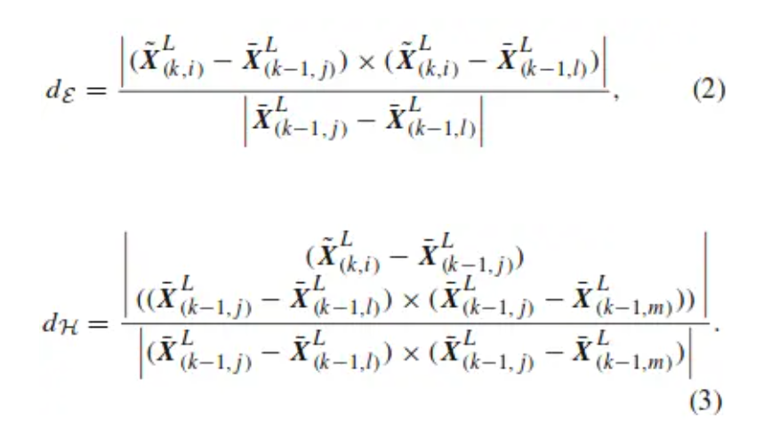
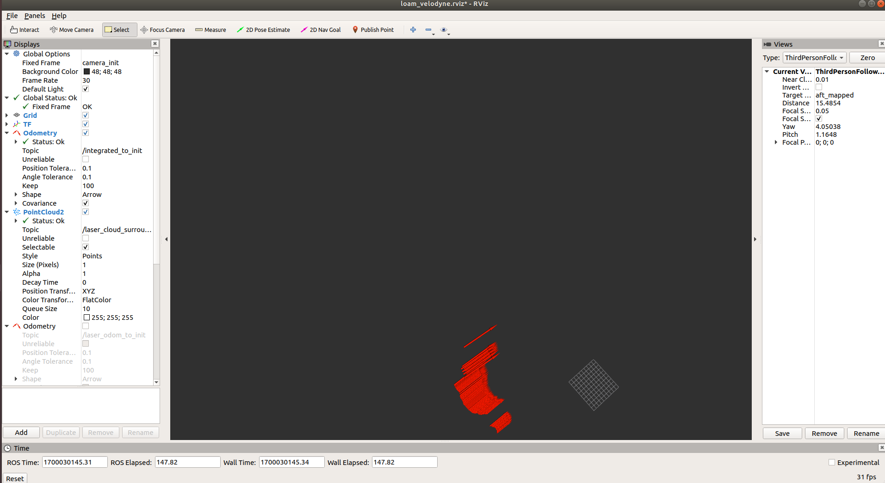
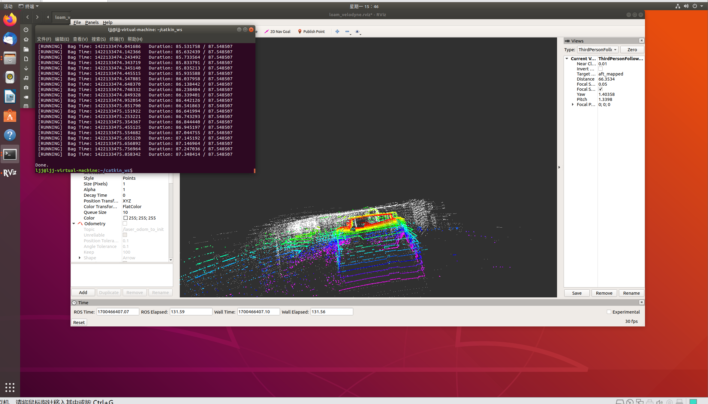

# LOAM代码及运行配置
## 一、代码阅读


LOAM的源码主要分为scanRegistration提取特征点、laserOdometry 10HZ估计位姿、laserMapping 1HZ构建三维地图、transforMaintenance 位姿优化等四个模块
### 1. scanRegistration.cpp
#### (1) 计算旋转角和点的线号和相对时间
```cpp
//lidar scan开始点的旋转角,atan2范围[-pi,+pi],计算旋转角时取负号是因为velodyne是顺时针旋转
float startOri = -atan2(laserCloudIn.points[0].y, laserCloudIn.points[0].x);
//lidar scan结束点的旋转角，加2*pi使点云旋转周期为2*pi
float endOri = -atan2(laserCloudIn.points[cloudSize - 1].y,
                    laserCloudIn.points[cloudSize - 1].x) + 2 * M_PI;

//结束方位角与开始方位角差值控制在(PI,3*PI)范围，允许lidar不是一个圆周扫描
//正常情况下在这个范围内：pi < endOri - startOri < 3*pi，异常则修正
if (endOri - startOri > 3 * M_PI) {
endOri -= 2 * M_PI;
} else if (endOri - startOri < M_PI) {
endOri += 2 * M_PI;
}
//lidar扫描线是否旋转过半
bool halfPassed = false;
int count = cloudSize;
PointType point;
std::vector<pcl::PointCloud<PointType> > laserCloudScans(N_SCANS);
for (int i = 0; i < cloudSize; i++) {
//坐标轴交换，velodyne lidar的坐标系也转换到z轴向前，x轴向左的右手坐标系
point.x = laserCloudIn.points[i].y;
point.y = laserCloudIn.points[i].z;
point.z = laserCloudIn.points[i].x;

//计算点的仰角(根据lidar文档垂直角计算公式),根据仰角排列激光线号，velodyne每两个scan之间间隔2度
float angle = atan(point.y / sqrt(point.x * point.x + point.z * point.z)) * 180 / M_PI;
int scanID;
//仰角四舍五入(加减0.5截断效果等于四舍五入)
int roundedAngle = int(angle + (angle<0.0-0.5:+0.5)); 
if (roundedAngle > 0){
    scanID = roundedAngle;
}
else {
    scanID = roundedAngle + (N_SCANS - 1);
}

//过滤点，只挑选[-15度，+15度]范围内的点,scanID属于[0,15]
if (scanID > (N_SCANS - 1) || scanID < 0 ){
    count--;
    continue;
}

//该点的旋转角
float ori = -atan2(point.x, point.z);
if (!halfPassed) {//根据扫描线是否旋转过半选择与起始位置还是终止位置进行差值计算，从而进行补偿
    //
    //确保-pi/2 < ori - startOri < 3*pi/2
    if (ori < startOri - M_PI / 2) {
    ori += 2 * M_PI;
    } else if (ori > startOri + M_PI * 3 / 2) {
    ori -= 2 * M_PI;
    }

    if (ori - startOri > M_PI) {
    halfPassed = true;
    }
} else {//
    ori += 2 * M_PI;
    //
    //确保-3*pi/2 < ori - endOri < pi/2
    if (ori < endOri - M_PI * 3 / 2) {
    ori += 2 * M_PI;
    } else if (ori > endOri + M_PI / 2) {
    ori -= 2 * M_PI;
    } 
}
//
//-0.5 < relTime < 1.5（点旋转的角度与整个周期旋转角度的比率, 即点云中点的相对时间）
float relTime = (ori - startOri) / (endOri - startOri);
//点强度=线号+点相对时间（即一个整数+一个小数，整数部分是线号，小数部分是该点的相对时间）,匀速扫描：根据当前扫描的角度和扫描周期计算相对扫描起始位置的时间
point.intensity = scanID + scanPeriod * relTime;
}
```
#### (2)IMU校正
```cpp
if (timeScanCur + pointTime > imuTime[imuPointerFront]) {//没找到,此时imuPointerFront==imtPointerLast,只能以当前收到的最新的IMU的速度，位移，欧拉角作为当前点的速度，位移，欧拉角使用
        imuRollCur = imuRoll[imuPointerFront];
        imuPitchCur = imuPitch[imuPointerFront];
        imuYawCur = imuYaw[imuPointerFront];

        imuVeloXCur = imuVeloX[imuPointerFront];
        imuVeloYCur = imuVeloY[imuPointerFront];
        imuVeloZCur = imuVeloZ[imuPointerFront];

        imuShiftXCur = imuShiftX[imuPointerFront];
        imuShiftYCur = imuShiftY[imuPointerFront];
        imuShiftZCur = imuShiftZ[imuPointerFront];
      } else {//找到了点云时间戳小于IMU时间戳的IMU位置,则该点必处于imuPointerBack和imuPointerFront之间，据此线性插值，计算点云点的速度，位移和欧拉角
        int imuPointerBack = (imuPointerFront + imuQueLength - 1) % imuQueLength;//
        //按时间距离计算权重分配比率,也即线性插值
        float ratioFront = (timeScanCur + pointTime - imuTime[imuPointerBack]) 
                         / (imuTime[imuPointerFront] - imuTime[imuPointerBack]);
        float ratioBack = (imuTime[imuPointerFront] - timeScanCur - pointTime) 
                        / (imuTime[imuPointerFront] - imuTime[imuPointerBack]);

        imuRollCur = imuRoll[imuPointerFront] * ratioFront + imuRoll[imuPointerBack] * ratioBack;
        imuPitchCur = imuPitch[imuPointerFront] * ratioFront + imuPitch[imuPointerBack] * ratioBack;
        if (imuYaw[imuPointerFront] - imuYaw[imuPointerBack] > M_PI) {
          imuYawCur = imuYaw[imuPointerFront] * ratioFront + (imuYaw[imuPointerBack] + 2 * M_PI) * ratioBack;
        } else if (imuYaw[imuPointerFront] - imuYaw[imuPointerBack] < -M_PI) {
          imuYawCur = imuYaw[imuPointerFront] * ratioFront + (imuYaw[imuPointerBack] - 2 * M_PI) * ratioBack;
        } else {
          imuYawCur = imuYaw[imuPointerFront] * ratioFront + imuYaw[imuPointerBack] * ratioBack;
        }

        //本质:imuVeloXCur = imuVeloX[imuPointerback] + (imuVelX[imuPointerFront]-imuVelX[imuPoniterBack])*ratioFront
        imuVeloXCur = imuVeloX[imuPointerFront] * ratioFront + imuVeloX[imuPointerBack] * ratioBack;
        imuVeloYCur = imuVeloY[imuPointerFront] * ratioFront + imuVeloY[imuPointerBack] * ratioBack;
        imuVeloZCur = imuVeloZ[imuPointerFront] * ratioFront + imuVeloZ[imuPointerBack] * ratioBack;

        imuShiftXCur = imuShiftX[imuPointerFront] * ratioFront + imuShiftX[imuPointerBack] * ratioBack;
        imuShiftYCur = imuShiftY[imuPointerFront] * ratioFront + imuShiftY[imuPointerBack] * ratioBack;
        imuShiftZCur = imuShiftZ[imuPointerFront] * ratioFront + imuShiftZ[imuPointerBack] * ratioBack;
```
#### (3)计算之后每个点相对于第一个点的由于加减速非匀速运动产生的位移速度畸变，并对点云中的每个点位置信息重新补偿矫正
```cpp
 if (i == 0) {//如果是第一个点,记住点云起始位置的速度，位移，欧拉角
        imuRollStart = imuRollCur;
        imuPitchStart = imuPitchCur;
        imuYawStart = imuYawCur;

        imuVeloXStart = imuVeloXCur;
        imuVeloYStart = imuVeloYCur;
        imuVeloZStart = imuVeloZCur;

        imuShiftXStart = imuShiftXCur;
        imuShiftYStart = imuShiftYCur;
        imuShiftZStart = imuShiftZCur;
      } else {//计算之后每个点相对于第一个点的由于加减速非匀速运动产生的位移速度畸变，并对点云中的每个点位置信息重新补偿矫正
        ShiftToStartIMU(pointTime);
        VeloToStartIMU();
        TransformToStartIMU(&point);
      }
    }
```
```cpp
//计算局部坐标系下点云中的点相对第一个开始点的由于加减速运动产生的位移畸变
void ShiftToStartIMU(float pointTime)
{
  //计算相对于第一个点由于加减速产生的畸变位移(全局坐标系下畸变位移量delta_Tg)
  //imuShiftFromStartCur = imuShiftCur - (imuShiftStart + imuVeloStart * pointTime)
  imuShiftFromStartXCur = imuShiftXCur - imuShiftXStart - imuVeloXStart * pointTime;
  imuShiftFromStartYCur = imuShiftYCur - imuShiftYStart - imuVeloYStart * pointTime;
  imuShiftFromStartZCur = imuShiftZCur - imuShiftZStart - imuVeloZStart * pointTime;

  /********************************************************************************
  Rz(pitch).inverse * Rx(pitch).inverse * Ry(yaw).inverse * delta_Tg
  transfrom from the global frame to the local frame
  *********************************************************************************/

  //绕y轴旋转(-imuYawStart)，即Ry(yaw).inverse
  float x1 = cos(imuYawStart) * imuShiftFromStartXCur - sin(imuYawStart) * imuShiftFromStartZCur;
  float y1 = imuShiftFromStartYCur;
  float z1 = sin(imuYawStart) * imuShiftFromStartXCur + cos(imuYawStart) * imuShiftFromStartZCur;

  //绕x轴旋转(-imuPitchStart)，即Rx(pitch).inverse
  float x2 = x1;
  float y2 = cos(imuPitchStart) * y1 + sin(imuPitchStart) * z1;
  float z2 = -sin(imuPitchStart) * y1 + cos(imuPitchStart) * z1;

  //绕z轴旋转(-imuRollStart)，即Rz(pitch).inverse
  imuShiftFromStartXCur = cos(imuRollStart) * x2 + sin(imuRollStart) * y2;
  imuShiftFromStartYCur = -sin(imuRollStart) * x2 + cos(imuRollStart) * y2;
  imuShiftFromStartZCur = z2;
}

//计算局部坐标系下点云中的点相对第一个开始点由于加减速产生的的速度畸变（增量）
void VeloToStartIMU()
{
  //计算相对于第一个点由于加减速产生的畸变速度(全局坐标系下畸变速度增量delta_Vg)
  imuVeloFromStartXCur = imuVeloXCur - imuVeloXStart;
  imuVeloFromStartYCur = imuVeloYCur - imuVeloYStart;
  imuVeloFromStartZCur = imuVeloZCur - imuVeloZStart;

  /********************************************************************************
    Rz(pitch).inverse * Rx(pitch).inverse * Ry(yaw).inverse * delta_Vg
    transfrom from the global frame to the local frame
  *********************************************************************************/
  
  //绕y轴旋转(-imuYawStart)，即Ry(yaw).inverse
  float x1 = cos(imuYawStart) * imuVeloFromStartXCur - sin(imuYawStart) * imuVeloFromStartZCur;
  float y1 = imuVeloFromStartYCur;
  float z1 = sin(imuYawStart) * imuVeloFromStartXCur + cos(imuYawStart) * imuVeloFromStartZCur;

  //绕x轴旋转(-imuPitchStart)，即Rx(pitch).inverse
  float x2 = x1;
  float y2 = cos(imuPitchStart) * y1 + sin(imuPitchStart) * z1;
  float z2 = -sin(imuPitchStart) * y1 + cos(imuPitchStart) * z1;

  //绕z轴旋转(-imuRollStart)，即Rz(pitch).inverse
  imuVeloFromStartXCur = cos(imuRollStart) * x2 + sin(imuRollStart) * y2;
  imuVeloFromStartYCur = -sin(imuRollStart) * x2 + cos(imuRollStart) * y2;
  imuVeloFromStartZCur = z2;
}

//去除点云加减速产生的位移畸变
void TransformToStartIMU(PointType *p)
{
  /********************************************************************************
    Ry*Rx*Rz*Pl, transform point to the global frame
  *********************************************************************************/
  //绕z轴旋转(imuRollCur)
  float x1 = cos(imuRollCur) * p->x - sin(imuRollCur) * p->y;
  float y1 = sin(imuRollCur) * p->x + cos(imuRollCur) * p->y;
  float z1 = p->z;

  //绕x轴旋转(imuPitchCur)
  float x2 = x1;
  float y2 = cos(imuPitchCur) * y1 - sin(imuPitchCur) * z1;
  float z2 = sin(imuPitchCur) * y1 + cos(imuPitchCur) * z1;

  //绕y轴旋转(imuYawCur)
  float x3 = cos(imuYawCur) * x2 + sin(imuYawCur) * z2;
  float y3 = y2;
  float z3 = -sin(imuYawCur) * x2 + cos(imuYawCur) * z2;

  /********************************************************************************
    Rz(pitch).inverse * Rx(pitch).inverse * Ry(yaw).inverse * Pg
    transfrom global points to the local frame
  *********************************************************************************/
  
  //绕y轴旋转(-imuYawStart)
  float x4 = cos(imuYawStart) * x3 - sin(imuYawStart) * z3;
  float y4 = y3;
  float z4 = sin(imuYawStart) * x3 + cos(imuYawStart) * z3;

  //绕x轴旋转(-imuPitchStart)
  float x5 = x4;
  float y5 = cos(imuPitchStart) * y4 + sin(imuPitchStart) * z4;
  float z5 = -sin(imuPitchStart) * y4 + cos(imuPitchStart) * z4;

  //绕z轴旋转(-imuRollStart)，然后叠加平移量
  p->x = cos(imuRollStart) * x5 + sin(imuRollStart) * y5 + imuShiftFromStartXCur;
  p->y = -sin(imuRollStart) * x5 + cos(imuRollStart) * y5 + imuShiftFromStartYCur;
  p->z = z5 + imuShiftFromStartZCur;
}

//积分速度与位移
void AccumulateIMUShift()
{
  float roll = imuRoll[imuPointerLast];
  float pitch = imuPitch[imuPointerLast];
  float yaw = imuYaw[imuPointerLast];
  float accX = imuAccX[imuPointerLast];
  float accY = imuAccY[imuPointerLast];
  float accZ = imuAccZ[imuPointerLast];

  //将当前时刻的加速度值绕交换过的ZXY固定轴（原XYZ）分别旋转(roll, pitch, yaw)角，转换得到世界坐标系下的加速度值(right hand rule)
  //绕z轴旋转(roll)
  float x1 = cos(roll) * accX - sin(roll) * accY;
  float y1 = sin(roll) * accX + cos(roll) * accY;
  float z1 = accZ;
  //绕x轴旋转(pitch)
  float x2 = x1;
  float y2 = cos(pitch) * y1 - sin(pitch) * z1;
  float z2 = sin(pitch) * y1 + cos(pitch) * z1;
  //绕y轴旋转(yaw)
  accX = cos(yaw) * x2 + sin(yaw) * z2;
  accY = y2;
  accZ = -sin(yaw) * x2 + cos(yaw) * z2;

  //上一个imu点
  int imuPointerBack = (imuPointerLast + imuQueLength - 1) % imuQueLength;
  //上一个点到当前点所经历的时间，即计算imu测量周期
  double timeDiff = imuTime[imuPointerLast] - imuTime[imuPointerBack];
  //要求imu的频率至少比lidar高，这样的imu信息才使用，后面校正也才有意义
  if (timeDiff < scanPeriod) {//（隐含从静止开始运动）
    //求每个imu时间点的位移与速度,两点之间视为匀加速直线运动
    imuShiftX[imuPointerLast] = imuShiftX[imuPointerBack] + imuVeloX[imuPointerBack] * timeDiff 
                              + accX * timeDiff * timeDiff / 2;
    imuShiftY[imuPointerLast] = imuShiftY[imuPointerBack] + imuVeloY[imuPointerBack] * timeDiff 
                              + accY * timeDiff * timeDiff / 2;
    imuShiftZ[imuPointerLast] = imuShiftZ[imuPointerBack] + imuVeloZ[imuPointerBack] * timeDiff 
                              + accZ * timeDiff * timeDiff / 2;

    imuVeloX[imuPointerLast] = imuVeloX[imuPointerBack] + accX * timeDiff;
    imuVeloY[imuPointerLast] = imuVeloY[imuPointerBack] + accY * timeDiff;
    imuVeloZ[imuPointerLast] = imuVeloZ[imuPointerBack] + accZ * timeDiff;
  }
}
//接收imu消息，imu坐标系为x轴向前，y轴向右，z轴向上的右手坐标系
void imuHandler(const sensor_msgs::Imu::ConstPtr& imuIn)
{
  double roll, pitch, yaw;
  tf::Quaternion orientation;
  //convert Quaternion msg to Quaternion
  tf::quaternionMsgToTF(imuIn->orientation, orientation);
  //This will get the roll pitch and yaw from the matrix about fixed axes X, Y, Z respectively. That's R = Rz(yaw)*Ry(pitch)*Rx(roll).
  //Here roll pitch yaw is in the global frame
  tf::Matrix3x3(orientation).getRPY(roll, pitch, yaw);

  //减去重力的影响,求出xyz方向的加速度实际值，并进行坐标轴交换，统一到z轴向前,x轴向左的右手坐标系, 交换过后RPY对应fixed axes ZXY(RPY---ZXY)。Now R = Ry(yaw)*Rx(pitch)*Rz(roll).
  float accX = imuIn->linear_acceleration.y - sin(roll) * cos(pitch) * 9.81;
  float accY = imuIn->linear_acceleration.z - cos(roll) * cos(pitch) * 9.81;
  float accZ = imuIn->linear_acceleration.x + sin(pitch) * 9.81;

  //循环移位效果，形成环形数组
  imuPointerLast = (imuPointerLast + 1) % imuQueLength;

  imuTime[imuPointerLast] = imuIn->header.stamp.toSec();
  imuRoll[imuPointerLast] = roll;
  imuPitch[imuPointerLast] = pitch;
  imuYaw[imuPointerLast] = yaw;
  imuAccX[imuPointerLast] = accX;
  imuAccY[imuPointerLast] = accY;
  imuAccZ[imuPointerLast] = accZ;

  AccumulateIMUShift();
}
```
#### (4)计算曲率并提取特征点
```cpp
pcl::PointCloud<PointType> cornerPointsSharp;
  pcl::PointCloud<PointType> cornerPointsLessSharp;
  pcl::PointCloud<PointType> surfPointsFlat;
  pcl::PointCloud<PointType> surfPointsLessFlat;

  //将每条线上的点分入相应的类别：边沿点和平面点
  for (int i = 0; i < N_SCANS; i++) {
    pcl::PointCloud<PointType>::Ptr surfPointsLessFlatScan(new pcl::PointCloud<PointType>);
    //将每个scan的曲率点分成6等份处理,确保周围都有点被选作特征点
    for (int j = 0; j < 6; j++) {
        //六等份起点：sp = scanStartInd + (scanEndInd - scanStartInd)*j/6
      int sp = (scanStartInd[i] * (6 - j)  + scanEndInd[i] * j) / 6;
      //六等份终点：ep = scanStartInd - 1 + (scanEndInd - scanStartInd)*(j+1)/6
      int ep = (scanStartInd[i] * (5 - j)  + scanEndInd[i] * (j + 1)) / 6 - 1;

      //按曲率从小到大冒泡排序
      for (int k = sp + 1; k <= ep; k++) {
        for (int l = k; l >= sp + 1; l--) {
            //如果后面曲率点大于前面，则交换
          if (cloudCurvature[cloudSortInd[l]] < cloudCurvature[cloudSortInd[l - 1]]) {
            int temp = cloudSortInd[l - 1];
            cloudSortInd[l - 1] = cloudSortInd[l];
            cloudSortInd[l] = temp;
          }
        }
      }

      //挑选每个分段的曲率很大和比较大的点
      int largestPickedNum = 0;
      for (int k = ep; k >= sp; k--) {
        int ind = cloudSortInd[k];  //曲率最大点的点序

        //如果曲率大的点，曲率的确比较大，并且未被筛选过滤掉
        if (cloudNeighborPicked[ind] == 0 &&
            cloudCurvature[ind] > 0.1) {
        
          largestPickedNum++;
          if (largestPickedNum <= 2) {//挑选曲率最大的前2个点放入sharp点集合
            cloudLabel[ind] = 2;//2代表点曲率很大
            cornerPointsSharp.push_back(laserCloud->points[ind]);
            cornerPointsLessSharp.push_back(laserCloud->points[ind]);
          } else if (largestPickedNum <= 20) {//挑选曲率最大的前20个点放入less sharp点集合
            cloudLabel[ind] = 1;//1代表点曲率比较尖锐
            cornerPointsLessSharp.push_back(laserCloud->points[ind]);
          } else {
            break;
          }

          cloudNeighborPicked[ind] = 1;//筛选标志置位

          //将曲率比较大的点的前后各5个连续距离比较近的点筛选出去，防止特征点聚集，使得特征点在每个方向上尽量分布均匀
          for (int l = 1; l <= 5; l++) {
            float diffX = laserCloud->points[ind + l].x 
                        - laserCloud->points[ind + l - 1].x;
            float diffY = laserCloud->points[ind + l].y 
                        - laserCloud->points[ind + l - 1].y;
            float diffZ = laserCloud->points[ind + l].z 
                        - laserCloud->points[ind + l - 1].z;
            if (diffX * diffX + diffY * diffY + diffZ * diffZ > 0.05) {
              break;
            }

            cloudNeighborPicked[ind + l] = 1;
          }
          for (int l = -1; l >= -5; l--) {
            float diffX = laserCloud->points[ind + l].x 
                        - laserCloud->points[ind + l + 1].x;
            float diffY = laserCloud->points[ind + l].y 
                        - laserCloud->points[ind + l + 1].y;
            float diffZ = laserCloud->points[ind + l].z 
                        - laserCloud->points[ind + l + 1].z;
            if (diffX * diffX + diffY * diffY + diffZ * diffZ > 0.05) {
              break;
            }

            cloudNeighborPicked[ind + l] = 1;
          }
        }
      }

      //挑选每个分段的曲率很小比较小的点
      int smallestPickedNum = 0;
      for (int k = sp; k <= ep; k++) {
        int ind = cloudSortInd[k];

        //如果曲率的确比较小，并且未被筛选出
        if (cloudNeighborPicked[ind] == 0 &&
            cloudCurvature[ind] < 0.1) {

          cloudLabel[ind] = -1;//-1代表曲率很小的点
          surfPointsFlat.push_back(laserCloud->points[ind]);

          smallestPickedNum++;
          if (smallestPickedNum >= 4) {//只选最小的四个，剩下的Label==0,就都是曲率比较小的
            break;
          }

          cloudNeighborPicked[ind] = 1;
          for (int l = 1; l <= 5; l++) {//同样防止特征点聚集
            float diffX = laserCloud->points[ind + l].x 
                        - laserCloud->points[ind + l - 1].x;
            float diffY = laserCloud->points[ind + l].y 
                        - laserCloud->points[ind + l - 1].y;
            float diffZ = laserCloud->points[ind + l].z 
                        - laserCloud->points[ind + l - 1].z;
            if (diffX * diffX + diffY * diffY + diffZ * diffZ > 0.05) {
              break;
            }

            cloudNeighborPicked[ind + l] = 1;
          }
          for (int l = -1; l >= -5; l--) {
            float diffX = laserCloud->points[ind + l].x 
                        - laserCloud->points[ind + l + 1].x;
            float diffY = laserCloud->points[ind + l].y 
                        - laserCloud->points[ind + l + 1].y;
            float diffZ = laserCloud->points[ind + l].z 
                        - laserCloud->points[ind + l + 1].z;
            if (diffX * diffX + diffY * diffY + diffZ * diffZ > 0.05) {
              break;
            }

            cloudNeighborPicked[ind + l] = 1;
          }
        }
      }

      //将剩余的点（包括之前被排除的点）全部归入平面点中less flat类别中
      for (int k = sp; k <= ep; k++) {
        if (cloudLabel[k] <= 0) {
          surfPointsLessFlatScan->push_back(laserCloud->points[k]);
        }
      }
    }

    //由于less flat点最多，对每个分段less flat的点进行体素栅格滤波
    pcl::PointCloud<PointType> surfPointsLessFlatScanDS;
    pcl::VoxelGrid<PointType> downSizeFilter;
    downSizeFilter.setInputCloud(surfPointsLessFlatScan);
    downSizeFilter.setLeafSize(0.2, 0.2, 0.2);
    downSizeFilter.filter(surfPointsLessFlatScanDS);

    //less flat点汇总
    surfPointsLessFlat += surfPointsLessFlatScanDS;
  }
```
处理两种不可取的点的方法:
- 处理第一种点，和激光平行的点。 前后点平方和大于深度平方和的0.0002，这些点视为离群点。
- 第二种排除容易被斜面挡住的点以及离群点开始。具体方式为先计算相邻两点的深度差，当某点及其后点间的距离平方大于某阈值a（说明这两点有一定距离），且两向量夹角小于某阈值b时（夹角小就可能存在遮挡）

### 2. laserOdometry.cpp
#### (1) 初始化
```cpp
//将第一个点云数据集发送给laserMapping,从下一个点云数据开始处理
      if (!systemInited) {
        //将cornerPointsLessSharp与laserCloudCornerLast交换,目的保存cornerPointsLessSharp的值下轮使用
        pcl::PointCloud<PointType>::Ptr laserCloudTemp = cornerPointsLessSharp;
        cornerPointsLessSharp = laserCloudCornerLast;
        laserCloudCornerLast = laserCloudTemp;

        //将surfPointLessFlat与laserCloudSurfLast交换，目的保存surfPointsLessFlat的值下轮使用
        laserCloudTemp = surfPointsLessFlat;
        surfPointsLessFlat = laserCloudSurfLast;
        laserCloudSurfLast = laserCloudTemp;

        //使用上一帧的特征点构建kd-tree
        kdtreeCornerLast->setInputCloud(laserCloudCornerLast);//所有的边沿点集合
        kdtreeSurfLast->setInputCloud(laserCloudSurfLast);//所有的平面点集合

        //将cornerPointsLessSharp和surfPointLessFlat点也即边沿点和平面点分别发送给laserMapping
        sensor_msgs::PointCloud2 laserCloudCornerLast2;
        pcl::toROSMsg(*laserCloudCornerLast, laserCloudCornerLast2);
        laserCloudCornerLast2.header.stamp = ros::Time().fromSec(timeSurfPointsLessFlat);
        laserCloudCornerLast2.header.frame_id = "/camera";
        pubLaserCloudCornerLast.publish(laserCloudCornerLast2);

        sensor_msgs::PointCloud2 laserCloudSurfLast2;
        pcl::toROSMsg(*laserCloudSurfLast, laserCloudSurfLast2);
        laserCloudSurfLast2.header.stamp = ros::Time().fromSec(timeSurfPointsLessFlat);
        laserCloudSurfLast2.header.frame_id = "/camera";
        pubLaserCloudSurfLast.publish(laserCloudSurfLast2);

        //记住原点的翻滚角和俯仰角
        transformSum[0] += imuPitchStart;
        transformSum[2] += imuRollStart;

        systemInited = true;
        continue;
      }

      //T平移量的初值赋值为加减速的位移量，为其梯度下降的方向（沿用上次转换的T（一个sweep匀速模型），同时在其基础上减去匀速运动位移，即只考虑加减速的位移量）
      transform[3] -= imuVeloFromStartX * scanPeriod;
      transform[4] -= imuVeloFromStartY * scanPeriod;
      transform[5] -= imuVeloFromStartZ * scanPeriod;
``` 
#### (2) 特征边/面上的点配准
##### 特征边的点配准
```cpp
if (laserCloudCornerLastNum > 10 && laserCloudSurfLastNum > 100) {
  std::vector<int> indices;
  pcl::removeNaNFromPointCloud(*cornerPointsSharp,*cornerPointsSharp, indices);
  int cornerPointsSharpNum = cornerPointsSharp->points.size();
  int surfPointsFlatNum = surfPointsFlat->points.size();
  
  //Levenberg-Marquardt算法(L-M method)，非线性最小二乘算法，最优化算法的一种
  //最多迭代25次
  for (int iterCount = 0; iterCount < 25; iterCount++) {
    laserCloudOri->clear();
    coeffSel->clear();

    //处理当前点云中的曲率最大的特征点,从上个点云中曲率比较大的特征点中找两个最近距离点，一个点使用kd-tree查找，另一个根据找到的点在其相邻线找另外一个最近距离的点
    for (int i = 0; i < cornerPointsSharpNum; i++) {
      TransformToStart(&cornerPointsSharp->points[i], &pointSel);

      //每迭代五次，重新查找最近点
      if (iterCount % 5 == 0) {
        std::vector<int> indices;
        pcl::removeNaNFromPointCloud(*laserCloudCornerLast,*laserCloudCornerLast, indices);
        //kd-tree查找一个最近距离点，边沿点未经过体素栅格滤波，一般边沿点本来就比较少，不做滤波
        kdtreeCornerLast->nearestKSearch(pointSel, 1, pointSearchInd, pointSearchSqDis);
        int closestPointInd = -1, minPointInd2 = -1;

        //寻找相邻线距离目标点距离最小的点
        //再次提醒：velodyne是2度一线，scanID相邻并不代表线号相邻，相邻线度数相差2度，也即线号scanID相差2
        if (pointSearchSqDis[0] < 25) {//找到的最近点距离的确很近的话
          closestPointInd = pointSearchInd[0];
          //提取最近点线号
          int closestPointScan = int(laserCloudCornerLast->points[closestPointInd].intensity);

          float pointSqDis, minPointSqDis2 = 25;//初始门槛值5米，可大致过滤掉scanID相邻，但实际线不相邻的值
          //寻找距离目标点最近距离的平方和最小的点
          for (int j = closestPointInd + 1; j < cornerPointsSharpNum; j++) {//向scanID增大的方向查找
            if (int(laserCloudCornerLast->points[j].intensity) > closestPointScan + 2.5) {//非相邻线
              break;
            }

            pointSqDis = (laserCloudCornerLast->points[j].x - pointSel.x) * 
                          (laserCloudCornerLast->points[j].x - pointSel.x) + 
                          (laserCloudCornerLast->points[j].y - pointSel.y) * 
                          (laserCloudCornerLast->points[j].y - pointSel.y) + 
                          (laserCloudCornerLast->points[j].z - pointSel.z) * 
                          (laserCloudCornerLast->points[j].z - pointSel.z);

            if (int(laserCloudCornerLast->points[j].intensity) > closestPointScan) {//确保两个点不在同一条scan上（相邻线查找应该可以用scanID == closestPointScan +/- 1 来做）
              if (pointSqDis < minPointSqDis2) {//距离更近，要小于初始值5米
                  //更新最小距离与点序
                minPointSqDis2 = pointSqDis;
                minPointInd2 = j;
              }
            }
          }

          //同理
          for (int j = closestPointInd - 1; j >= 0; j--) {//向scanID减小的方向查找
            if (int(laserCloudCornerLast->points[j].intensity) < closestPointScan - 2.5) {
              break;
            }

            pointSqDis = (laserCloudCornerLast->points[j].x - pointSel.x) * 
                          (laserCloudCornerLast->points[j].x - pointSel.x) + 
                          (laserCloudCornerLast->points[j].y - pointSel.y) * 
                          (laserCloudCornerLast->points[j].y - pointSel.y) + 
                          (laserCloudCornerLast->points[j].z - pointSel.z) * 
                          (laserCloudCornerLast->points[j].z - pointSel.z);

            if (int(laserCloudCornerLast->points[j].intensity) < closestPointScan) {
              if (pointSqDis < minPointSqDis2) {
                minPointSqDis2 = pointSqDis;
                minPointInd2 = j;
              }
            }
          }
        }

        //记住组成线的点序
        pointSearchCornerInd1[i] = closestPointInd;//kd-tree最近距离点，-1表示未找到满足的点
        pointSearchCornerInd2[i] = minPointInd2;//另一个最近的，-1表示未找到满足的点
      }
```
##### 特征面上的点配准
```cpp
//对本次接收到的曲率最小的点,从上次接收到的点云曲率比较小的点中找三点组成平面，一个使用kd-tree查找，另外一个在同一线上查找满足要求的，第三个在不同线上查找满足要求的
for (int i = 0; i < surfPointsFlatNum; i++) {
  TransformToStart(&surfPointsFlat->points[i], &pointSel);

  if (iterCount % 5 == 0) {
      //kd-tree最近点查找，在经过体素栅格滤波之后的平面点中查找，一般平面点太多，滤波后最近点查找数据量小
    kdtreeSurfLast->nearestKSearch(pointSel, 1, pointSearchInd, pointSearchSqDis);
    int closestPointInd = -1, minPointInd2 = -1, minPointInd3 = -1;
    if (pointSearchSqDis[0] < 25) {
      closestPointInd = pointSearchInd[0];
      int closestPointScan = int(laserCloudSurfLast->points[closestPointInd].intensity);

      float pointSqDis, minPointSqDis2 = 25, minPointSqDis3 = 25;
      for (int j = closestPointInd + 1; j < surfPointsFlatNum; j++) {
        if (int(laserCloudSurfLast->points[j].intensity) > closestPointScan + 2.5) {
          break;
        }

        pointSqDis = (laserCloudSurfLast->points[j].x - pointSel.x) * 
                      (laserCloudSurfLast->points[j].x - pointSel.x) + 
                      (laserCloudSurfLast->points[j].y - pointSel.y) * 
                      (laserCloudSurfLast->points[j].y - pointSel.y) + 
                      (laserCloudSurfLast->points[j].z - pointSel.z) * 
                      (laserCloudSurfLast->points[j].z - pointSel.z);

        if (int(laserCloudSurfLast->points[j].intensity) <= closestPointScan) {//如果点的线号小于等于最近点的线号(应该最多取等，也即同一线上的点)
            if (pointSqDis < minPointSqDis2) {
              minPointSqDis2 = pointSqDis;
              minPointInd2 = j;
            }
        } else {//如果点处在大于该线上
            if (pointSqDis < minPointSqDis3) {
              minPointSqDis3 = pointSqDis;
              minPointInd3 = j;
            }
        }
      }


      //同理
      for (int j = closestPointInd - 1; j >= 0; j--) {
        if (int(laserCloudSurfLast->points[j].intensity) < closestPointScan - 2.5) {
          break;
        }

        pointSqDis = (laserCloudSurfLast->points[j].x - pointSel.x) * 
                      (laserCloudSurfLast->points[j].x - pointSel.x) + 
                      (laserCloudSurfLast->points[j].y - pointSel.y) * 
                      (laserCloudSurfLast->points[j].y - pointSel.y) + 
                      (laserCloudSurfLast->points[j].z - pointSel.z) * 
                      (laserCloudSurfLast->points[j].z - pointSel.z);

        if (int(laserCloudSurfLast->points[j].intensity) >= closestPointScan) {
          if (pointSqDis < minPointSqDis2) {
            minPointSqDis2 = pointSqDis;
            minPointInd2 = j;
          }
        } else {
          if (pointSqDis < minPointSqDis3) {
            minPointSqDis3 = pointSqDis;
            minPointInd3 = j;
          }
        }
      }
    }

    pointSearchSurfInd1[i] = closestPointInd;//kd-tree最近距离点,-1表示未找到满足要求的点
    pointSearchSurfInd2[i] = minPointInd2;//同一线号上的距离最近的点，-1表示未找到满足要求的点
    pointSearchSurfInd3[i] = minPointInd3;//不同线号上的距离最近的点，-1表示未找到满足要求的点
  }
```
#### (3) 构建Jaccobian矩阵
##### 计算约束方程

边:
```cpp
if (pointSearchCornerInd2[i] >= 0) {//大于等于0，不等于-1，说明两个点都找到了
    tripod1 = laserCloudCornerLast->points[pointSearchCornerInd1[i]];
    tripod2 = laserCloudCornerLast->points[pointSearchCornerInd2[i]];

    //选择的特征点记为O，kd-tree最近距离点记为A，另一个最近距离点记为B
    float x0 = pointSel.x;
    float y0 = pointSel.y;
    float z0 = pointSel.z;
    float x1 = tripod1.x;
    float y1 = tripod1.y;
    float z1 = tripod1.z;
    float x2 = tripod2.x;
    float y2 = tripod2.y;
    float z2 = tripod2.z;

    //向量OA = (x0 - x1, y0 - y1, z0 - z1), 向量OB = (x0 - x2, y0 - y2, z0 - z2)，向量AB = （x1 - x2, y1 - y2, z1 - z2）
    //向量OA OB的向量积(即叉乘)为：
    //|  i      j      k  |
    //|x0-x1  y0-y1  z0-z1|
    //|x0-x2  y0-y2  z0-z2|
    //模为：
    float a012 = sqrt(((x0 - x1)*(y0 - y2) - (x0 - x2)*(y0 - y1))
                * ((x0 - x1)*(y0 - y2) - (x0 - x2)*(y0 - y1)) 
                + ((x0 - x1)*(z0 - z2) - (x0 - x2)*(z0 - z1))
                * ((x0 - x1)*(z0 - z2) - (x0 - x2)*(z0 - z1)) 
                + ((y0 - y1)*(z0 - z2) - (y0 - y2)*(z0 - z1))
                * ((y0 - y1)*(z0 - z2) - (y0 - y2)*(z0 - z1)));

    //两个最近距离点之间的距离，即向量AB的模
    float l12 = sqrt((x1 - x2)*(x1 - x2) + (y1 - y2)*(y1 - y2) + (z1 - z2)*(z1 - z2));

    //AB方向的单位向量与OAB平面的单位法向量的向量积在各轴上的分量（d的方向）
    //x轴分量i
    float la = ((y1 - y2)*((x0 - x1)*(y0 - y2) - (x0 - x2)*(y0 - y1)) 
              + (z1 - z2)*((x0 - x1)*(z0 - z2) - (x0 - x2)*(z0 - z1))) / a012 / l12;

    //y轴分量j
    float lb = -((x1 - x2)*((x0 - x1)*(y0 - y2) - (x0 - x2)*(y0 - y1)) 
              - (z1 - z2)*((y0 - y1)*(z0 - z2) - (y0 - y2)*(z0 - z1))) / a012 / l12;

    //z轴分量k
    float lc = -((x1 - x2)*((x0 - x1)*(z0 - z2) - (x0 - x2)*(z0 - z1)) 
              + (y1 - y2)*((y0 - y1)*(z0 - z2) - (y0 - y2)*(z0 - z1))) / a012 / l12;

    //点到线的距离，d = |向量OA 叉乘 向量OB|/|AB|
    float ld2 = a012 / l12;

    //unused
    pointProj = pointSel;
    pointProj.x -= la * ld2;
    pointProj.y -= lb * ld2;
    pointProj.z -= lc * ld2;

    //权重计算，距离越大权重越小，距离越小权重越大，得到的权重范围<=1
    float s = 1;
    if (iterCount >= 5) {//5次迭代之后开始增加权重因素
      s = 1 - 1.8 * fabs(ld2);
    }

    //考虑权重
    coeff.x = s * la;
    coeff.y = s * lb;
    coeff.z = s * lc;
    coeff.intensity = s * ld2;

    if (s > 0.1 && ld2 != 0) {//只保留权重大的，也即距离比较小的点，同时也舍弃距离为零的
      laserCloudOri->push_back(cornerPointsSharp->points[i]);
      coeffSel->push_back(coeff);
    }
  }
```
面:
```cpp
if (pointSearchSurfInd2[i] >= 0 && pointSearchSurfInd3[i] >= 0) {//找到了三个点
    tripod1 = laserCloudSurfLast->points[pointSearchSurfInd1[i]];//A点
    tripod2 = laserCloudSurfLast->points[pointSearchSurfInd2[i]];//B点
    tripod3 = laserCloudSurfLast->points[pointSearchSurfInd3[i]];//C点

    //向量AB = (tripod2.x - tripod1.x, tripod2.y - tripod1.y, tripod2.z - tripod1.z)
    //向量AC = (tripod3.x - tripod1.x, tripod3.y - tripod1.y, tripod3.z - tripod1.z)

    //向量AB AC的向量积（即叉乘），得到的是法向量
    //x轴方向分向量i
    float pa = (tripod2.y - tripod1.y) * (tripod3.z - tripod1.z) 
              - (tripod3.y - tripod1.y) * (tripod2.z - tripod1.z);
    //y轴方向分向量j
    float pb = (tripod2.z - tripod1.z) * (tripod3.x - tripod1.x) 
              - (tripod3.z - tripod1.z) * (tripod2.x - tripod1.x);
    //z轴方向分向量k
    float pc = (tripod2.x - tripod1.x) * (tripod3.y - tripod1.y) 
              - (tripod3.x - tripod1.x) * (tripod2.y - tripod1.y);
    float pd = -(pa * tripod1.x + pb * tripod1.y + pc * tripod1.z);

    //法向量的模
    float ps = sqrt(pa * pa + pb * pb + pc * pc);
    //pa pb pc为法向量各方向上的单位向量
    pa /= ps;
    pb /= ps;
    pc /= ps;
    pd /= ps;

    //点到面的距离：向量OA与与法向量的点积除以法向量的模
    float pd2 = pa * pointSel.x + pb * pointSel.y + pc * pointSel.z + pd;

    //unused
    pointProj = pointSel;
    pointProj.x -= pa * pd2;
    pointProj.y -= pb * pd2;
    pointProj.z -= pc * pd2;

    //同理计算权重
    float s = 1;
    if (iterCount >= 5) {
      s = 1 - 1.8 * fabs(pd2) / sqrt(sqrt(pointSel.x * pointSel.x
        + pointSel.y * pointSel.y + pointSel.z * pointSel.z));
    }

    //考虑权重
    coeff.x = s * pa;
    coeff.y = s * pb;
    coeff.z = s * pc;
    coeff.intensity = s * pd2;

    if (s > 0.1 && pd2 != 0) {
        //保存原始点与相应的系数
      laserCloudOri->push_back(surfPointsFlat->points[i]);
      coeffSel->push_back(coeff);
    }
  }
```
#### (4)L-M运动估计求解
```cpp
int pointSelNum = laserCloudOri->points.size();
    //满足要求的特征点至少10个，特征匹配数量太少弃用此帧数据
    if (pointSelNum < 10) {
      continue;
    }

    cv::Mat matA(pointSelNum, 6, CV_32F, cv::Scalar::all(0));
    cv::Mat matAt(6, pointSelNum, CV_32F, cv::Scalar::all(0));
    cv::Mat matAtA(6, 6, CV_32F, cv::Scalar::all(0));
    cv::Mat matB(pointSelNum, 1, CV_32F, cv::Scalar::all(0));
    cv::Mat matAtB(6, 1, CV_32F, cv::Scalar::all(0));
    cv::Mat matX(6, 1, CV_32F, cv::Scalar::all(0));

    //计算matA,matB矩阵
    for (int i = 0; i < pointSelNum; i++) {
      pointOri = laserCloudOri->points[i];
      coeff = coeffSel->points[i];

      float s = 1;

      float srx = sin(s * transform[0]);
      float crx = cos(s * transform[0]);
      float sry = sin(s * transform[1]);
      float cry = cos(s * transform[1]);
      float srz = sin(s * transform[2]);
      float crz = cos(s * transform[2]);
      float tx = s * transform[3];
      float ty = s * transform[4];
      float tz = s * transform[5];

      float arx = (-s*crx*sry*srz*pointOri.x + s*crx*crz*sry*pointOri.y + s*srx*sry*pointOri.z 
                + s*tx*crx*sry*srz - s*ty*crx*crz*sry - s*tz*srx*sry) * coeff.x
                + (s*srx*srz*pointOri.x - s*crz*srx*pointOri.y + s*crx*pointOri.z
                + s*ty*crz*srx - s*tz*crx - s*tx*srx*srz) * coeff.y
                + (s*crx*cry*srz*pointOri.x - s*crx*cry*crz*pointOri.y - s*cry*srx*pointOri.z
                + s*tz*cry*srx + s*ty*crx*cry*crz - s*tx*crx*cry*srz) * coeff.z;

      float ary = ((-s*crz*sry - s*cry*srx*srz)*pointOri.x 
                + (s*cry*crz*srx - s*sry*srz)*pointOri.y - s*crx*cry*pointOri.z 
                + tx*(s*crz*sry + s*cry*srx*srz) + ty*(s*sry*srz - s*cry*crz*srx) 
                + s*tz*crx*cry) * coeff.x
                + ((s*cry*crz - s*srx*sry*srz)*pointOri.x 
                + (s*cry*srz + s*crz*srx*sry)*pointOri.y - s*crx*sry*pointOri.z
                + s*tz*crx*sry - ty*(s*cry*srz + s*crz*srx*sry) 
                - tx*(s*cry*crz - s*srx*sry*srz)) * coeff.z;

      float arz = ((-s*cry*srz - s*crz*srx*sry)*pointOri.x + (s*cry*crz - s*srx*sry*srz)*pointOri.y
                + tx*(s*cry*srz + s*crz*srx*sry) - ty*(s*cry*crz - s*srx*sry*srz)) * coeff.x
                + (-s*crx*crz*pointOri.x - s*crx*srz*pointOri.y
                + s*ty*crx*srz + s*tx*crx*crz) * coeff.y
                + ((s*cry*crz*srx - s*sry*srz)*pointOri.x + (s*crz*sry + s*cry*srx*srz)*pointOri.y
                + tx*(s*sry*srz - s*cry*crz*srx) - ty*(s*crz*sry + s*cry*srx*srz)) * coeff.z;

      float atx = -s*(cry*crz - srx*sry*srz) * coeff.x + s*crx*srz * coeff.y 
                - s*(crz*sry + cry*srx*srz) * coeff.z;

      float aty = -s*(cry*srz + crz*srx*sry) * coeff.x - s*crx*crz * coeff.y 
                - s*(sry*srz - cry*crz*srx) * coeff.z;

      float atz = s*crx*sry * coeff.x - s*srx * coeff.y - s*crx*cry * coeff.z;

      float d2 = coeff.intensity;

      matA.at<float>(i, 0) = arx;
      matA.at<float>(i, 1) = ary;
      matA.at<float>(i, 2) = arz;
      matA.at<float>(i, 3) = atx;
      matA.at<float>(i, 4) = aty;
      matA.at<float>(i, 5) = atz;
      matB.at<float>(i, 0) = -0.05 * d2;
    }
    cv::transpose(matA, matAt);
    matAtA = matAt * matA;
    matAtB = matAt * matB;
    //求解matAtA * matX = matAtB
    cv::solve(matAtA, matAtB, matX, cv::DECOMP_QR);

    if (iterCount == 0) {
      //特征值1*6矩阵
      cv::Mat matE(1, 6, CV_32F, cv::Scalar::all(0));
      //特征向量6*6矩阵
      cv::Mat matV(6, 6, CV_32F, cv::Scalar::all(0));
      cv::Mat matV2(6, 6, CV_32F, cv::Scalar::all(0));

      //求解特征值/特征向量
      cv::eigen(matAtA, matE, matV);
      matV.copyTo(matV2);

      isDegenerate = false;
      //特征值取值门槛
      float eignThre[6] = {10, 10, 10, 10, 10, 10};
      for (int i = 5; i >= 0; i--) {//从小到大查找
        if (matE.at<float>(0, i) < eignThre[i]) {//特征值太小，则认为处在兼并环境中，发生了退化
          for (int j = 0; j < 6; j++) {//对应的特征向量置为0
            matV2.at<float>(i, j) = 0;
          }
          isDegenerate = true;
        } else {
          break;
        }
      }

      //计算P矩阵
      matP = matV.inv() * matV2;
    }

    if (isDegenerate) {//如果发生退化，只使用预测矩阵P计算
      cv::Mat matX2(6, 1, CV_32F, cv::Scalar::all(0));
      matX.copyTo(matX2);
      matX = matP * matX2;
    }

    //累加每次迭代的旋转平移量
    transform[0] += matX.at<float>(0, 0);
    transform[1] += matX.at<float>(1, 0);
    transform[2] += matX.at<float>(2, 0);
    transform[3] += matX.at<float>(3, 0);
    transform[4] += matX.at<float>(4, 0);
    transform[5] += matX.at<float>(5, 0);

    for(int i=0; i<6; i++){
      if(isnan(transform[i]))//判断是否非数字
        transform[i]=0;
    }
    //计算旋转平移量，如果很小就停止迭代
    float deltaR = sqrt(
                        pow(rad2deg(matX.at<float>(0, 0)), 2) +
                        pow(rad2deg(matX.at<float>(1, 0)), 2) +
                        pow(rad2deg(matX.at<float>(2, 0)), 2));
    float deltaT = sqrt(
                        pow(matX.at<float>(3, 0) * 100, 2) +
                        pow(matX.at<float>(4, 0) * 100, 2) +
                        pow(matX.at<float>(5, 0) * 100, 2));

    if (deltaR < 0.1 && deltaT < 0.1) {//迭代终止条件
      break;
    }
  }
```
#### (5)坐标转换
算出了点云间的相对运动，但他们是在这两帧点云的局部坐标系下的，我们需要把它转换到世界坐标系下，因此需要进行转换。
```cpp
float rx, ry, rz, tx, ty, tz;
    //求相对于原点的旋转量,垂直方向上1.05倍修正?
    AccumulateRotation(transformSum[0], transformSum[1], transformSum[2], 
                        -transform[0], -transform[1] * 1.05, -transform[2], rx, ry, rz);

    float x1 = cos(rz) * (transform[3] - imuShiftFromStartX) 
              - sin(rz) * (transform[4] - imuShiftFromStartY);
    float y1 = sin(rz) * (transform[3] - imuShiftFromStartX) 
              + cos(rz) * (transform[4] - imuShiftFromStartY);
    float z1 = transform[5] * 1.05 - imuShiftFromStartZ;

    float x2 = x1;
    float y2 = cos(rx) * y1 - sin(rx) * z1;
    float z2 = sin(rx) * y1 + cos(rx) * z1;

    //求相对于原点的平移量
    tx = transformSum[3] - (cos(ry) * x2 + sin(ry) * z2);
    ty = transformSum[4] - y2;
    tz = transformSum[5] - (-sin(ry) * x2 + cos(ry) * z2);

    //根据IMU修正旋转量
    PluginIMURotation(rx, ry, rz, imuPitchStart, imuYawStart, imuRollStart, 
                      imuPitchLast, imuYawLast, imuRollLast, rx, ry, rz);

    //得到世界坐标系下的转移矩阵
    transformSum[0] = rx;
    transformSum[1] = ry;
    transformSum[2] = rz;
    transformSum[3] = tx;
    transformSum[4] = ty;
    transformSum[5] = tz;

    //欧拉角转换成四元数
    geometry_msgs::Quaternion geoQuat = tf::createQuaternionMsgFromRollPitchYaw(rz, -rx, -ry);

    //publish四元数和平移量
    laserOdometry.header.stamp = ros::Time().fromSec(timeSurfPointsLessFlat);
    laserOdometry.pose.pose.orientation.x = -geoQuat.y;
    laserOdometry.pose.pose.orientation.y = -geoQuat.z;
    laserOdometry.pose.pose.orientation.z = geoQuat.x;
    laserOdometry.pose.pose.orientation.w = geoQuat.w;
    laserOdometry.pose.pose.position.x = tx;
    laserOdometry.pose.pose.position.y = ty;
    laserOdometry.pose.pose.position.z = tz;
    pubLaserOdometry.publish(laserOdometry);
```
```cpp
//对点云的曲率比较大和比较小的点投影到扫描结束位置
  int cornerPointsLessSharpNum = cornerPointsLessSharp->points.size();
  for (int i = 0; i < cornerPointsLessSharpNum; i++) {
    TransformToEnd(&cornerPointsLessSharp->points[i], &cornerPointsLessSharp->points[i]);
  }

  int surfPointsLessFlatNum = surfPointsLessFlat->points.size();
  for (int i = 0; i < surfPointsLessFlatNum; i++) {
    TransformToEnd(&surfPointsLessFlat->points[i], &surfPointsLessFlat->points[i]);
  }

  frameCount++;
  //点云全部点，每间隔一个点云数据相对点云最后一个点进行畸变校正
  if (frameCount >= skipFrameNum + 1) {
    int laserCloudFullResNum = laserCloudFullRes->points.size();
    for (int i = 0; i < laserCloudFullResNum; i++) {
      TransformToEnd(&laserCloudFullRes->points[i], &laserCloudFullRes->points[i]);
    }
  }

  //畸变校正之后的点作为last点保存等下个点云进来进行匹配
  pcl::PointCloud<PointType>::Ptr laserCloudTemp = cornerPointsLessSharp;
  cornerPointsLessSharp = laserCloudCornerLast;
  laserCloudCornerLast = laserCloudTemp;

  laserCloudTemp = surfPointsLessFlat;
  surfPointsLessFlat = laserCloudSurfLast;
  laserCloudSurfLast = laserCloudTemp;

  laserCloudCornerLastNum = laserCloudCornerLast->points.size();
  laserCloudSurfLastNum = laserCloudSurfLast->points.size();
  //点足够多就构建kd-tree，否则弃用此帧，沿用上一帧数据的kd-tree
  if (laserCloudCornerLastNum > 10 && laserCloudSurfLastNum > 100) {
    kdtreeCornerLast->setInputCloud(laserCloudCornerLast);
    kdtreeSurfLast->setInputCloud(laserCloudSurfLast);
  }

  //按照跳帧数publich边沿点，平面点以及全部点给laserMapping(每隔一帧发一次)
  if (frameCount >= skipFrameNum + 1) {
    frameCount = 0;

    sensor_msgs::PointCloud2 laserCloudCornerLast2;
    pcl::toROSMsg(*laserCloudCornerLast, laserCloudCornerLast2);
    laserCloudCornerLast2.header.stamp = ros::Time().fromSec(timeSurfPointsLessFlat);
    laserCloudCornerLast2.header.frame_id = "/camera";
    pubLaserCloudCornerLast.publish(laserCloudCornerLast2);

    sensor_msgs::PointCloud2 laserCloudSurfLast2;
    pcl::toROSMsg(*laserCloudSurfLast, laserCloudSurfLast2);
    laserCloudSurfLast2.header.stamp = ros::Time().fromSec(timeSurfPointsLessFlat);
    laserCloudSurfLast2.header.frame_id = "/camera";
    pubLaserCloudSurfLast.publish(laserCloudSurfLast2);

    sensor_msgs::PointCloud2 laserCloudFullRes3;
    pcl::toROSMsg(*laserCloudFullRes, laserCloudFullRes3);
    laserCloudFullRes3.header.stamp = ros::Time().fromSec(timeSurfPointsLessFlat);
    laserCloudFullRes3.header.frame_id = "/camera";
    pubLaserCloudFullRes.publish(laserCloudFullRes3);
  }
```
### 3. laserMapping.cpp
- 为什么要有这个建图节点？
为什么要有建图节点。正如我们刚才所说，Lidar里程计的结果不准确，拼起来的点也完全不成样子，且它会不断发散，因此误差也会越来越大。试想一下我们对特征的提取仅仅只是关注了他们的曲率，这种方式怎么可能完美的得到两帧点云准确的配准点。且点云中的点是离散的，我们也无法保证上一帧的点在下一帧中仍会被扫到。总之，无论我们多努力想让Lidar里程计的估计结果变得精准，残酷且冰冷的显示都会把我们的幻想击碎。因此，我们需要依靠别的方式去优化Lidar里程计的位姿估计精度。在SLAM领域，一般会采用与地图匹配的方式来优化这一结果。其实道理也很简单，我们始终认为后一时刻的观测较前一时刻带有更多的误差，换而言之，我们更加信任前一时刻结果。因此我们对已经构建地图的信任程度远高于临帧点云配准后的Lidar运动估计。所以我们可以利用已构建地图对位姿估计结果进行修正。
- 建图节点又到底起了什么作用？
建图节点起到了什么作用？在回答上一个问题时也已经提到了，它的作用就是优化Lidar里程计的位姿估计结果。怎么做呢？没错，就是利用地图。试想一下，你在得到第一帧点云时你的lidar就扫到了数万个点，此时Lidar的位置我们把它作为（0,0,0），在不考虑测量噪声的情况下这数万个点都是相对精确的，我们把这数万个点所构成的环境作为此时的地图。而后Lidar运动了一小段，我们通过Lidar里程计的方法估算了它的相对运动，于是就可以将此时的Lidar位姿及此时的点按照我们估计的相对运动情况，转换到上一时刻（建立地图时的坐标系）的坐标系下。只不过由于里程计估计误差，地图可能拼歪了。既然这样，我是如果把地图完整的拼上去，是不是就可以优化此时Lidar的位姿了呢？这就是建图节点起到的关键作用。只不过拿当前扫描的点云和地图中所有点云去配准，这个计算消耗太大，因此为了保证实时性，作者在这里采用了一种低频处理方法，即调用建图节点的频率仅为调用里程计节点频率的十分之一。

代码详解见:
 https://zhuanlan.zhihu.com/p/145858994

### 4. transformMaintenance.cpp
```cpp
//odometry计算的转移矩阵(实时高频量)
float transformSum[6] = {0};
//平移增量
float transformIncre[6] = {0};
//经过mapping矫正过后的最终的世界坐标系下的位姿
float transformMapped[6] = {0};
//mapping传递过来的优化前的位姿
float transformBefMapped[6] = {0};
//mapping传递过来的优化后的位姿
float transformAftMapped[6] = {0};

ros::Publisher *pubLaserOdometry2Pointer = NULL;
tf::TransformBroadcaster *tfBroadcaster2Pointer = NULL;
nav_msgs::Odometry laserOdometry2;
tf::StampedTransform laserOdometryTrans2;

//odometry的运动估计和mapping矫正量融合之后得到的最终的位姿transformMapped
void transformAssociateToMap()
{
  //平移后绕y轴旋转（-transformSum[1]）
  float x1 = cos(transformSum[1]) * (transformBefMapped[3] - transformSum[3]) 
           - sin(transformSum[1]) * (transformBefMapped[5] - transformSum[5]);
  float y1 = transformBefMapped[4] - transformSum[4];
  float z1 = sin(transformSum[1]) * (transformBefMapped[3] - transformSum[3]) 
           + cos(transformSum[1]) * (transformBefMapped[5] - transformSum[5]);

  //绕x轴旋转（-transformSum[0]）
  float x2 = x1;
  float y2 = cos(transformSum[0]) * y1 + sin(transformSum[0]) * z1;
  float z2 = -sin(transformSum[0]) * y1 + cos(transformSum[0]) * z1;

  //绕z轴旋转（-transformSum[2]）
  transformIncre[3] = cos(transformSum[2]) * x2 + sin(transformSum[2]) * y2;
  transformIncre[4] = -sin(transformSum[2]) * x2 + cos(transformSum[2]) * y2;
  transformIncre[5] = z2;

  float sbcx = sin(transformSum[0]);
  float cbcx = cos(transformSum[0]);
  float sbcy = sin(transformSum[1]);
  float cbcy = cos(transformSum[1]);
  float sbcz = sin(transformSum[2]);
  float cbcz = cos(transformSum[2]);

  float sblx = sin(transformBefMapped[0]);
  float cblx = cos(transformBefMapped[0]);
  float sbly = sin(transformBefMapped[1]);
  float cbly = cos(transformBefMapped[1]);
  float sblz = sin(transformBefMapped[2]);
  float cblz = cos(transformBefMapped[2]);

  float salx = sin(transformAftMapped[0]);
  float calx = cos(transformAftMapped[0]);
  float saly = sin(transformAftMapped[1]);
  float caly = cos(transformAftMapped[1]);
  float salz = sin(transformAftMapped[2]);
  float calz = cos(transformAftMapped[2]);

  float srx = -sbcx*(salx*sblx + calx*cblx*salz*sblz + calx*calz*cblx*cblz)
            - cbcx*sbcy*(calx*calz*(cbly*sblz - cblz*sblx*sbly)
            - calx*salz*(cbly*cblz + sblx*sbly*sblz) + cblx*salx*sbly)
            - cbcx*cbcy*(calx*salz*(cblz*sbly - cbly*sblx*sblz) 
            - calx*calz*(sbly*sblz + cbly*cblz*sblx) + cblx*cbly*salx);
  transformMapped[0] = -asin(srx);

  float srycrx = sbcx*(cblx*cblz*(caly*salz - calz*salx*saly)
               - cblx*sblz*(caly*calz + salx*saly*salz) + calx*saly*sblx)
               - cbcx*cbcy*((caly*calz + salx*saly*salz)*(cblz*sbly - cbly*sblx*sblz)
               + (caly*salz - calz*salx*saly)*(sbly*sblz + cbly*cblz*sblx) - calx*cblx*cbly*saly)
               + cbcx*sbcy*((caly*calz + salx*saly*salz)*(cbly*cblz + sblx*sbly*sblz)
               + (caly*salz - calz*salx*saly)*(cbly*sblz - cblz*sblx*sbly) + calx*cblx*saly*sbly);
  float crycrx = sbcx*(cblx*sblz*(calz*saly - caly*salx*salz)
               - cblx*cblz*(saly*salz + caly*calz*salx) + calx*caly*sblx)
               + cbcx*cbcy*((saly*salz + caly*calz*salx)*(sbly*sblz + cbly*cblz*sblx)
               + (calz*saly - caly*salx*salz)*(cblz*sbly - cbly*sblx*sblz) + calx*caly*cblx*cbly)
               - cbcx*sbcy*((saly*salz + caly*calz*salx)*(cbly*sblz - cblz*sblx*sbly)
               + (calz*saly - caly*salx*salz)*(cbly*cblz + sblx*sbly*sblz) - calx*caly*cblx*sbly);
  transformMapped[1] = atan2(srycrx / cos(transformMapped[0]), 
                             crycrx / cos(transformMapped[0]));
  
  float srzcrx = (cbcz*sbcy - cbcy*sbcx*sbcz)*(calx*salz*(cblz*sbly - cbly*sblx*sblz)
               - calx*calz*(sbly*sblz + cbly*cblz*sblx) + cblx*cbly*salx)
               - (cbcy*cbcz + sbcx*sbcy*sbcz)*(calx*calz*(cbly*sblz - cblz*sblx*sbly)
               - calx*salz*(cbly*cblz + sblx*sbly*sblz) + cblx*salx*sbly)
               + cbcx*sbcz*(salx*sblx + calx*cblx*salz*sblz + calx*calz*cblx*cblz);
  float crzcrx = (cbcy*sbcz - cbcz*sbcx*sbcy)*(calx*calz*(cbly*sblz - cblz*sblx*sbly)
               - calx*salz*(cbly*cblz + sblx*sbly*sblz) + cblx*salx*sbly)
               - (sbcy*sbcz + cbcy*cbcz*sbcx)*(calx*salz*(cblz*sbly - cbly*sblx*sblz)
               - calx*calz*(sbly*sblz + cbly*cblz*sblx) + cblx*cbly*salx)
               + cbcx*cbcz*(salx*sblx + calx*cblx*salz*sblz + calx*calz*cblx*cblz);
  transformMapped[2] = atan2(srzcrx / cos(transformMapped[0]), 
                             crzcrx / cos(transformMapped[0]));

  x1 = cos(transformMapped[2]) * transformIncre[3] - sin(transformMapped[2]) * transformIncre[4];
  y1 = sin(transformMapped[2]) * transformIncre[3] + cos(transformMapped[2]) * transformIncre[4];
  z1 = transformIncre[5];

  x2 = x1;
  y2 = cos(transformMapped[0]) * y1 - sin(transformMapped[0]) * z1;
  z2 = sin(transformMapped[0]) * y1 + cos(transformMapped[0]) * z1;

  transformMapped[3] = transformAftMapped[3] 
                     - (cos(transformMapped[1]) * x2 + sin(transformMapped[1]) * z2);
  transformMapped[4] = transformAftMapped[4] - y2;
  transformMapped[5] = transformAftMapped[5] 
                     - (-sin(transformMapped[1]) * x2 + cos(transformMapped[1]) * z2);
}

//接收laserOdometry的信息
void laserOdometryHandler(const nav_msgs::Odometry::ConstPtr& laserOdometry)
{
  double roll, pitch, yaw;
  geometry_msgs::Quaternion geoQuat = laserOdometry->pose.pose.orientation;
  tf::Matrix3x3(tf::Quaternion(geoQuat.z, -geoQuat.x, -geoQuat.y, geoQuat.w)).getRPY(roll, pitch, yaw);

  //得到旋转平移矩阵
  transformSum[0] = -pitch;
  transformSum[1] = -yaw;
  transformSum[2] = roll;

  transformSum[3] = laserOdometry->pose.pose.position.x;
  transformSum[4] = laserOdometry->pose.pose.position.y;
  transformSum[5] = laserOdometry->pose.pose.position.z;

  transformAssociateToMap();

  geoQuat = tf::createQuaternionMsgFromRollPitchYaw
            (transformMapped[2], -transformMapped[0], -transformMapped[1]);

  laserOdometry2.header.stamp = laserOdometry->header.stamp;
  laserOdometry2.pose.pose.orientation.x = -geoQuat.y;
  laserOdometry2.pose.pose.orientation.y = -geoQuat.z;
  laserOdometry2.pose.pose.orientation.z = geoQuat.x;
  laserOdometry2.pose.pose.orientation.w = geoQuat.w;
  laserOdometry2.pose.pose.position.x = transformMapped[3];
  laserOdometry2.pose.pose.position.y = transformMapped[4];
  laserOdometry2.pose.pose.position.z = transformMapped[5];
  pubLaserOdometry2Pointer->publish(laserOdometry2);

  //发送旋转平移量
  laserOdometryTrans2.stamp_ = laserOdometry->header.stamp;
  laserOdometryTrans2.setRotation(tf::Quaternion(-geoQuat.y, -geoQuat.z, geoQuat.x, geoQuat.w));
  laserOdometryTrans2.setOrigin(tf::Vector3(transformMapped[3], transformMapped[4], transformMapped[5]));
  tfBroadcaster2Pointer->sendTransform(laserOdometryTrans2);
}

//接收laserMapping的转换信息
void odomAftMappedHandler(const nav_msgs::Odometry::ConstPtr& odomAftMapped)
{
  double roll, pitch, yaw;
  geometry_msgs::Quaternion geoQuat = odomAftMapped->pose.pose.orientation;
  tf::Matrix3x3(tf::Quaternion(geoQuat.z, -geoQuat.x, -geoQuat.y, geoQuat.w)).getRPY(roll, pitch, yaw);

  transformAftMapped[0] = -pitch;
  transformAftMapped[1] = -yaw;
  transformAftMapped[2] = roll;

  transformAftMapped[3] = odomAftMapped->pose.pose.position.x;
  transformAftMapped[4] = odomAftMapped->pose.pose.position.y;
  transformAftMapped[5] = odomAftMapped->pose.pose.position.z;

  transformBefMapped[0] = odomAftMapped->twist.twist.angular.x;
  transformBefMapped[1] = odomAftMapped->twist.twist.angular.y;
  transformBefMapped[2] = odomAftMapped->twist.twist.angular.z;

  transformBefMapped[3] = odomAftMapped->twist.twist.linear.x;
  transformBefMapped[4] = odomAftMapped->twist.twist.linear.y;
  transformBefMapped[5] = odomAftMapped->twist.twist.linear.z;
}
```
## 二、实验验证
一开始使用了ubuntu22.04来配置环境运行，一开始没发现由于编译pcl时make导致swap空间爆了而倒是虚拟机差点出问题，后面增加swap空间成功编译pcl。

然后接着尝试了几个星期，发现最后到catkin_make的时候都会出现问题，发现ubuntu22.04采用的ros版本似乎和catkin_make所要用到的依赖包有冲突，所以放弃了ubuntu22.04

重新装了ubuntu18.04

按照参考链接:
https://blog.csdn.net/weixin_48924581/article/details/122461138

成功配置好了环境
(中间要注意虚拟机的磁盘和swap空间要够，不然好不容易快编译好了会出问题闪退，导致要重新来，我使用了make -j2来编译，花费的时间长了一点，但是不会出现swap空间不足的 问题)

配置完环境之后，运行:

可以看到只显示了路径，没有点云

后来查阅资料并和同学对比，成功的同学是装了双系统，可能是因为自己在虚拟机上做的，导致可能是其他问题，例如说rviz问题

然后参考链接:
https://blog.csdn.net/Pichai/article/details/123648573

输入命令:
```
export LIBGL_ALWAYS_SOFTWARE=1
```
关闭硬件加速

重新实验，得到正确结果:


## reference 
reference:

https://zhuanlan.zhihu.com/p/145857388

https://zhuanlan.zhihu.com/p/29719106
