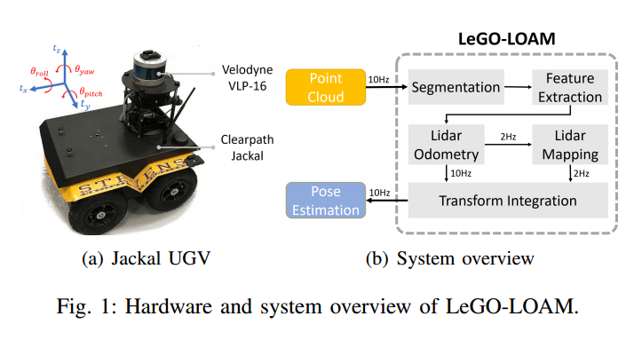
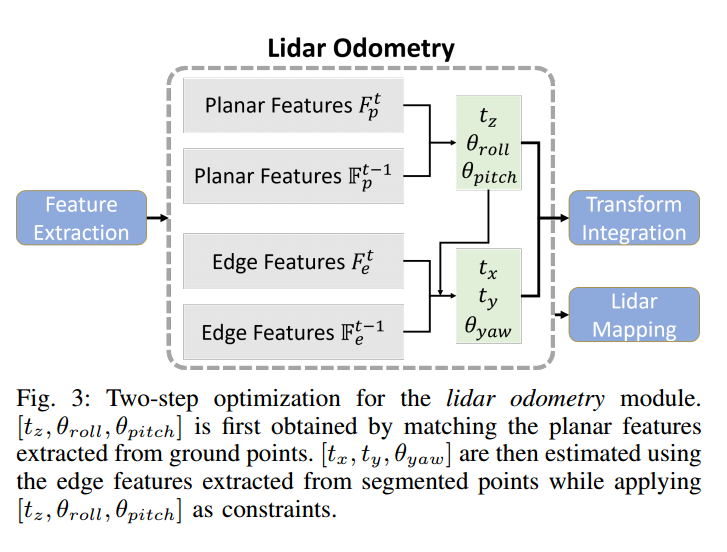
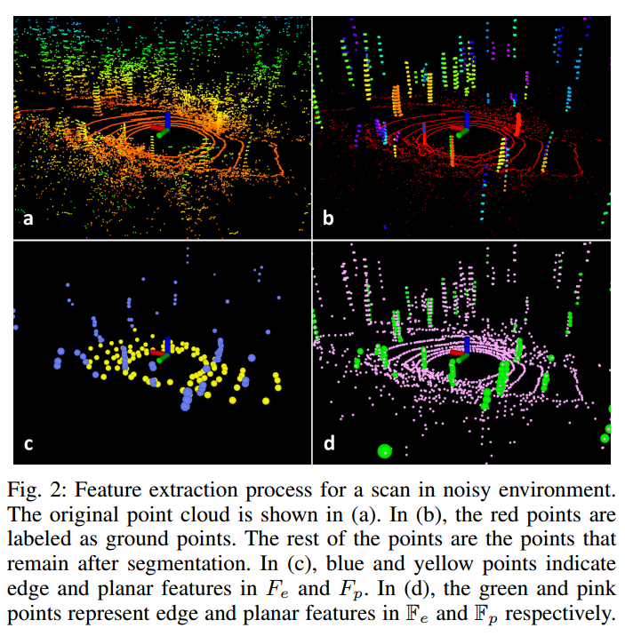
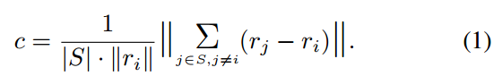
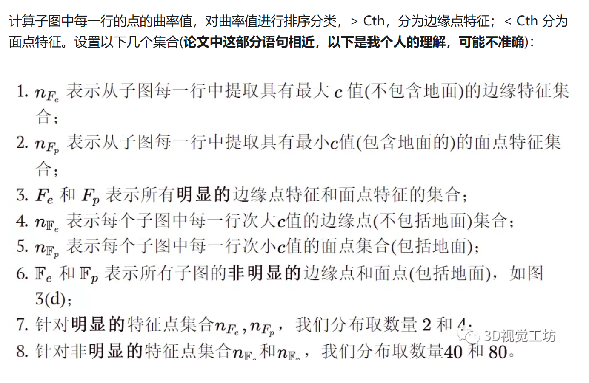
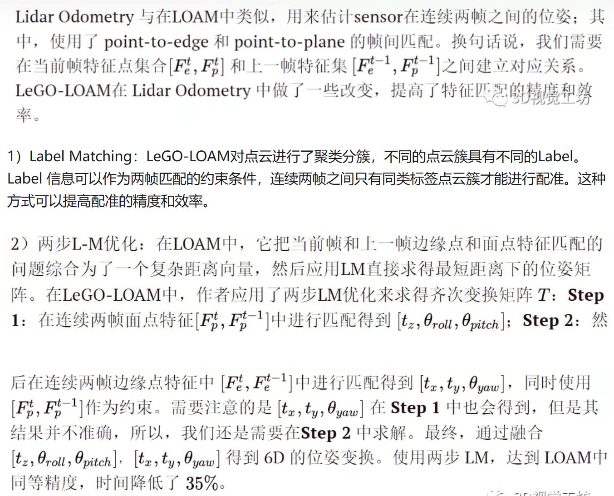
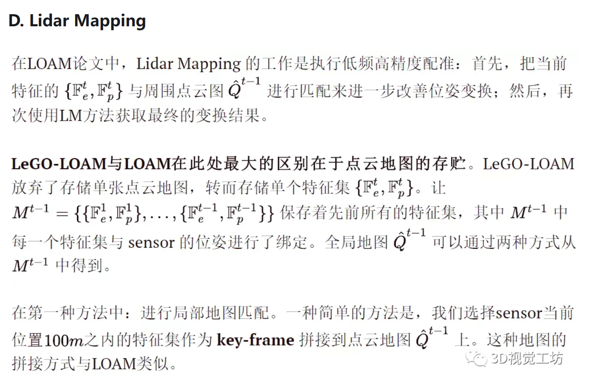

# Lightweight and Groud-Optimized Lidar Odometry and Mapping on Variable Terrain

## 摘要
```
Abstract— We propose a lightweight and ground-optimized lidar odometry and mapping method, LeGO-LOAM, for realtime six degree-of-freedom pose estimation with ground vehicles. LeGO-LOAM is lightweight, as it can achieve realtime pose estimation on a low-power embedded system. LeGOLOAM is ground-optimized, as it leverages the presence of a ground plane in its segmentation and optimization steps. We first apply point cloud segmentation to filter out noise, and feature extraction to obtain distinctive planar and edge features.

A two-step Levenberg-Marquardt optimization method then uses the planar and edge features to solve different components of the six degree-of-freedom transformation across consecutive scans. We compare the performance of LeGO-LOAM with a state-of-the-art method, LOAM, using datasets gathered from variable-terrain environments with ground vehicles, and show that LeGO-LOAM achieves similar or better accuracy with reduced computational expense. We also integrate LeGO-LOAM into a SLAM framework to eliminate the pose estimation error caused by drift, which is tested using the KITTI dataset.

摘要:我们提出了一种轻量级的地面优化激光雷达测程和制图方法，LeGO-LOAM，用于地面车辆的实时六自由度姿态估计。LeGO-LOAM是轻量级的，因为它可以在低功耗嵌入式系统上实现实时姿态估计。LeGO-LOAM是地面优化的，因为它在分割和优化步骤中利用了地平面的存在。我们首先利用点云分割来滤除噪声，然后利用特征提取来获得鲜明的平面和边缘特征。


然后采用两步Levenberg-Marquardt优化方法，利用平面和边缘特征求解跨连续扫描的六自由度变换的不同分量。我们将LeGO-LOAM与最先进的方法LOAM的性能进行了比较，使用从地面车辆的可变地形环境中收集的数据集，并表明LeGO-LOAM在减少计算费用的情况下实现了相似或更好的精度。我们还将LeGO-LOAM集成到SLAM框架中，以消除漂移引起的姿态估计误差，并使用KITTI数据集进行了测试。
```


## 论文中 LOAM  局限性 和 LeGO-LOAM的改进
###  LOAM  局限性 
LOAM框架在这样的硬件环境和使用场景中会存在一些问题：

1. 由于搭载的是嵌入式系统，计算能力将会受限，LOAM的计算需要将难以满足，致使无法做到实时；
2. 如果使用LOAM框架，系统计算每个点曲率的处理频率（数据量很大，VLP-16一条线是1800个点）将难以跟上传感器的更新频率；
3. UGA行驶的路面是非平滑连续的（运动是颠簸的），采集的数据将会失真（运动畸变，匀速运动模型4无法适用于颠簸场景），使用LOAM很难在两帧之间找到可靠的特征对应。
4. 在噪杂的环境中操作UGV也会给LOAM带来一些挑战，例如：浮动的草丛和摆动的树叶的点云将被误提取为角点或面点，这些特征是不可靠的，难以在连续帧之间获取准确的匹配，从而会造成较大的漂移。

###   LeGO-LOAM的改进
- 相较于LOAM的第一个改进：**增加基于柱面投影特征分割**，对原始点云进行地面点分割和目标聚类。
- 相较于LOAM的第二个改进：**基于分割点云的线面特征提取**，从地面点和目标聚类点云中提取线、面特征，特征点更精确。
- 相较于LOAM的第三个改进：**采用两步法实现laserOdometry线程的位姿优化计算**，在优化估计精度保持不变的情况下收敛速度极大提升。
- 相较于LOAM的第四个改进：**采用关键帧进行局部地图和全局地图的管理**，邻近点云的索引更为便捷。
- 相较于LOAM的第五个改进：**增加基于距离的闭环检测和全局优化**，构成完整的激光SLAM解决方案。
## 设计思路
LeGO-LOAM的设计想法中利用了地平面信息。

- 首先，对采集到的点云进行聚类分割，分离出地面点云(地面点代表了绝大部分不稳定的特征点)，同时滤出异常点。
- 然后，使用LM进行两步优化解决连续帧之间的6自由度的变换:第一步是使用地面点云估算出平面变换参数 **[$t_{z}$,$Θ_{roll}$,$Θ_{pitch}$]**;第二步是对分割后点云中边缘点和面点进行匹配得到 **[$t_{x}$,$t_{y}$,$Θ_{yaw}$]**。最后，作者还进行了回环检测别正运动估计漂移。

## 

整个系统分为五个模块。第一种方法是分割，将单个扫描的点云投影到范围图像上进行分割。然后将分割后的点云发送到特征提取模块。然后，激光雷达里程计使用从前一个模块中提取的特征来找到与连续扫描相关的变换。这些特征在激光雷达测绘中进行进一步处理，将它们注册到全局点云图中。最后，变换积分模块将激光测距和激光测绘的姿态估计结果进行融合，输出最终姿态估计结果。



### Segmentation

**P ={p1,p2,...,pn}** 视为**t**时刻扫描得到的点云。把 $P_{t}$ 投射为一个距离图像，其中P中每个有效点在距离图像中都有一个唯一的像素点与之对应，像素值 $ r_{i}$  表示对应点 $ p_{i}$   与sensor的距离值。在很多环境中，倾斜的地形很常见，论文中小车的实验场景也并不是平整的。对距离图像的column-wiseevaluation(柱状评价)可以视为是对地面估计，从而实现对地面的提取。



1. 在分割前，对距离图像进行逐列评估，可视为地平面估计，以提取地点。在此过程之后，可能代表地的点被标记为地点，而不用于分割。

2. 然后，对距离图像采用基于图像的分割方法，将点分成多个聚类。来自同一簇的点被分配一个唯一的标签。请注意，接地点是一种特殊类型的群集。对点云进行分割可以提高处理效率和特征提取精度。假设机器人在嘈杂的环境中工作，小物体，如树叶，可能会形成琐碎和不可靠的特征，因为相同的叶子不太可能在连续两次扫描中被看到。
   
3. 为了使用分割点云进行快速可靠的特征提取，我们省略了少于30个点的聚类。点云分割前后的可视化如图2所示。原始点云包含许多点，这些点从周围的植被中获得，可能会产生不可靠的特征。经过处理之后变成了图2(b)，只剩下大物体点云，例如:树干。地面点云将被保留以作进一步处理。此时，保留下来的每个点将具备三种属性:
- (1)点云的标签
- (2)在距离图像中的行列数
- (3)距离值。

### Feature Extraction
LeGO-LOAM不是从原始点云中提取特征，而是从地面点和分割点中提取特征。设S为距离像同一行连续点的集合。**S**中一半的点在两边。在本文中，将 **|S|** 设置为10。

利用分割过程中计算的范围值，我们可以评估**S**中点 **$p_{i}$** 的粗糙度:



为了从各个方向均匀地提取特征，将距离图像水平划分为几个相等的子图像。

然后，根据子图像的粗糙度值**c**对每一行中的点进行排序。与LOAM类似，使用阈值 **$c_{th}$** 来区分不同类型的特征。我们称**c**大于 **$c_{th}$** 的点为边缘特征，称**c**小于 **$c_{th}$** 的点为平面特征。然后从子图像的每一行中选取不属于地面的、**c**值最大的 **$n_{\mathbb{F_{e}}}$** 个边缘特征点。

以同样的方式选择具有最小**c**的 **$n_{\mathbb{F_{p}}}$**  平面特征点，这些特征点可以标记为地面点或分段点。设 **${\mathbb{F_{e}}}$** 和 **${\mathbb{F_{p}}}$** 为所有子图像的所有边缘和平面特征的集合。这些特征如图2(d)所示。然后，我们从子图像的每一行提取最大**c**的 **$n_{F_{e}}$** 边缘特征，这些特征不属于地面。同样，我们从子图像的每一行提取具有最小**c**的 **$n_{F_{p}}$** 平面特征，这些特征必须是接地点。设 **${\mathbb{F_{e}}}$** 和 **${\mathbb{F_{p}}}$** 为该过程中所有边缘和平面特征的集合。这里，我们有 **${{F_{e}}}$** ∈ **${\mathbb{F_{e}}}$** 和 **${{F_{p}}}$** ∈ **${\mathbb{F_{p}}}$**。Fe和Fp的特征如图2(c)所示。在本文中，我们将360度范围的图像分成6个子图像。每个子图像的分辨率为300 × 16。 **$n_{F_{e}}$** ;**$n_{F_{p}}$**;**$n_{\mathbb{F_{e}}}$** 和 **$n_{\mathbb{F_{p}}}$** 分别取2、4、40和80。


### Lidar Odometry

### Lidar Mapping


## 总结与讨论

LeGO-LOAM，一种轻量级的地面优化激光雷达测程和制图方法，用于在复杂环境中对ugv进行实时姿态估计。LeGO-LOAM是轻量级的，因为它可以在嵌入式系统上使用并实现实时性能。

LeGO-LOAM还对地面进行了优化，利用了地面分离、点云分割和改进的L-M优化。在这个过程中，可能代表不可靠特征的无价值点被过滤掉。两步L-M优化分别计算姿态变换的不同分量。在室外环境下收集的一系列UGV数据集上对该方法进行了评估，与loam相比，LeGO-loam可以达到相似或更好的精度
LeGO-LOAM的计算时间也大大减少。

LeGO-LOAM不仅整合了LOAM的系统结构，同时对LOAM中的特征提取、位姿估计计算都进行了优化改进，此外还加入了闭环检测和全局优化，将LOAM这一LO系统构建为完整的SLAM系统，

## reference : 
https://zhuanlan.zhihu.com/p/426478348 

https://zhuanlan.zhihu.com/p/511968459