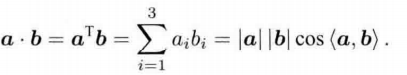
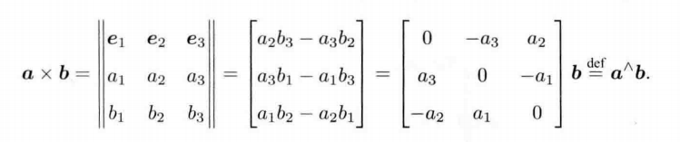
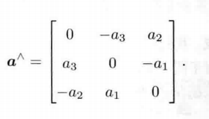
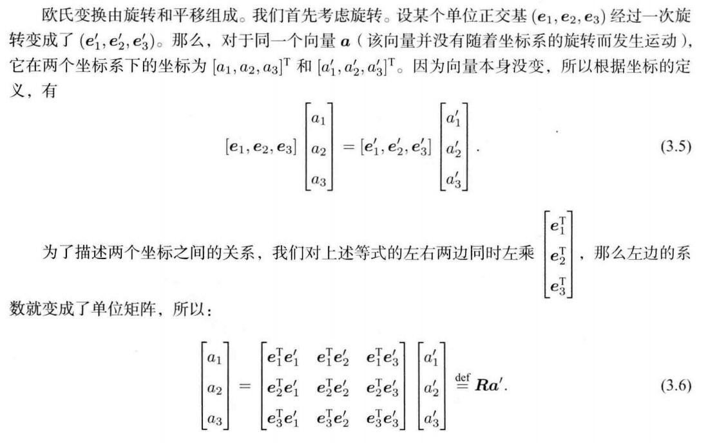
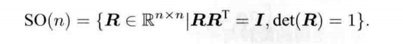
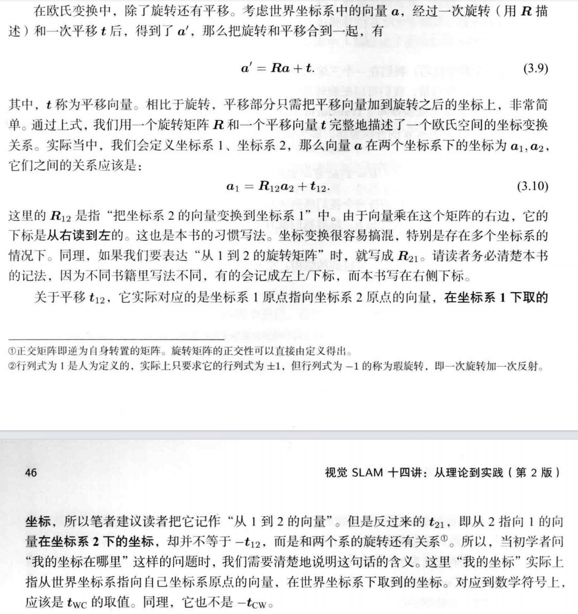
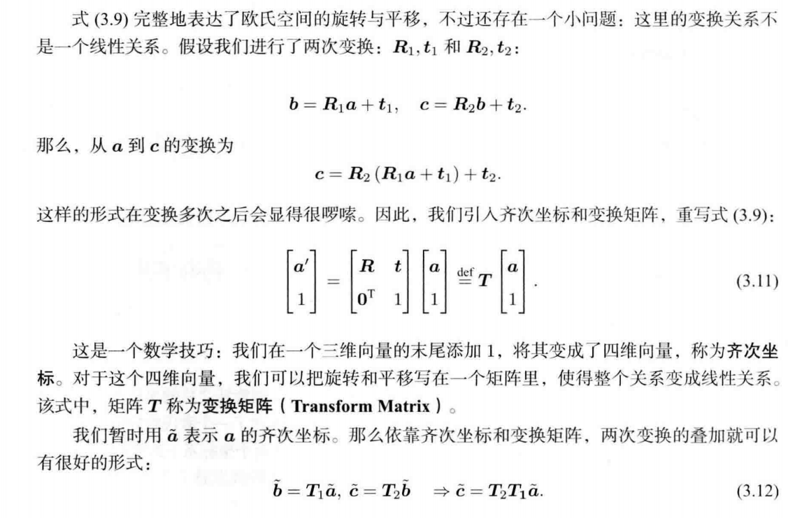
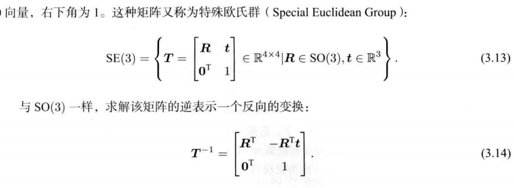
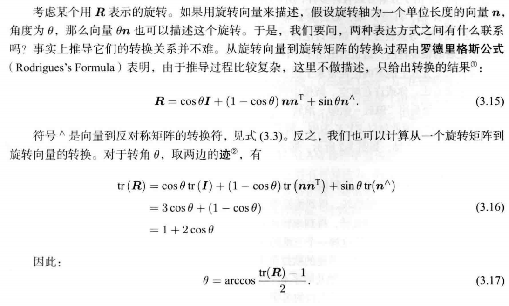

# 第3讲 三维空间刚体运动
## 3.1 旋转矩阵
### 3.1.1 点、向量和坐标系
a,b属于${R}^{3}$
* 内积:
  
* 外积:
  
  外积的结果是一个向量，它的方向垂直于这两个向量，大小为|a||b|sin<a,b>，是两个向量张成的四边形的有向面积。
  aXb写成了a^b,变成了线性计算
  如何向量都对应着唯一的一个反对称矩阵:
   
  
  (反对称矩阵A满足${A}^{T}$=-A)
    
### 3.1.2坐标系间的欧式变换

如果考虑运动的机器人，那么常见的做法是设定一个惯性坐标系(或者叫世界坐标系)，可以认为它是固定不动的。同时，相机或机器人是一个移动坐标系。相机视野中某个向量 p，它在相机坐标系下的坐标为  ${p}_{c}$ ，而从世界坐标系下看，它的坐标为 ${p}_{w}$ ，那么，这两个坐标之间是如何转换的呢?这时，就需要先得到该点针对机器人坐标系的坐标值，再根据机器人位姿变换到世界坐标系中。我们需要一种数学手段来描述这个变换关系，稍后我们会看到，可以用一个矩阵T来描述它

两个坐标系之间的运动由一个旋转加上一个平移组成，这种运动称为刚体运动。相机运动就是一个刚体运动。刚体运动过程中，同一个向量在各个坐标系下的长度和夹角都不会发生变化,只可能有空间位置和姿态的不同，而它自己的长度、各个面的角度等性质不会有任何变化。

矩阵R描述了旋转本身。因此，称为旋转矩阵(Rotation Matrix)。同时，该矩阵各分量是两个坐标系基的内积，由于基向量的长度为 1，所以实际上是各基向量夹角的余弦值。所以这个矩阵也叫方向余弦矩阵(Direction Cosine Matrix)。我们后文统一称它为旋转矩阵。

旋转矩阵有一些特别的性质。事实上，它是一个行列式为1的正交矩阵,。反之，行列式为1的正交矩阵也是一个旋转矩阵。所以，可以将n 维旋转矩阵的集合定义如下：

### 3.1.3变换矩阵与齐次坐标

## 3.2 EIGEN
## 3.3 旋转向量与欧拉角
### 3.3.1 旋转向量
旋转矩阵表示方式至少有以下两个缺点:
* 1.SO(3)的旋转矩阵有9个量，但一次旋转只有3个自度。因此这种表达方式是冗余的同理，变换矩阵用 16个量表达了6自由度的变换。
* 2.旋转矩阵自身带有约束:它必须是个正交矩阵，且行列式为1。变换矩阵也是如此。当想估计或优化一个旋转矩阵或变换矩阵时，这些约束会使得求解变得更困难
 
因此，我们希望有一种方式能够紧凑地描述旋转和平移。例如，用一个三维向量表达旋转用一个六维向量表达变换。事实上，任意旋转都可以用一个旋转轴和一个旋转角来刻画。于是，我们可以使用一个向量，其方向与旋转轴一致，而长度等于旋转角。这种向量称为旋转向量(或轴角/角轴，Axis-Angle)只需一个三维向量即可描述旋转。同样对于变换矩阵，我们使用一个旋转向量和一个平移向量即可表达一次变换。这时的变量维数正好是六维。

### 3.3.2 欧拉角
当我们看到一个旋转矩阵或旋转向量时，很难想象出这个旋转究竟是什么样的。

而欧拉角则提供了一种非常直观的方式来描述旋转一一它使用了3个分离的转角，把一个旋转分解成3次绕不同轴的旋转。

但是，由于分解方式有许多种，所以欧拉角也存在着众多不同的、易于混淆的定义方法例如，先绕X轴，再绕Y轴，最后绕Z轴旋转，就得到了一个XYZ轴的旋转。同理，可以定义ZYZ、ZYX等旋转方式。
